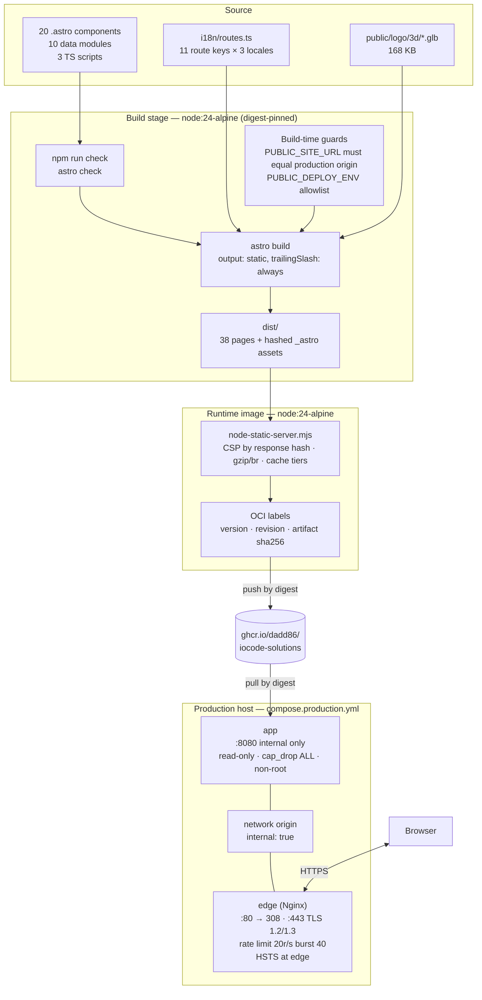
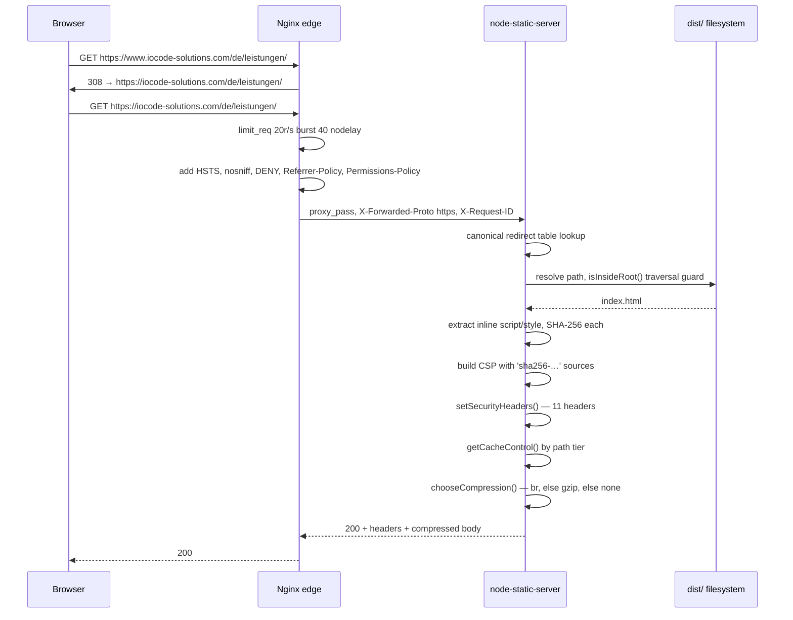
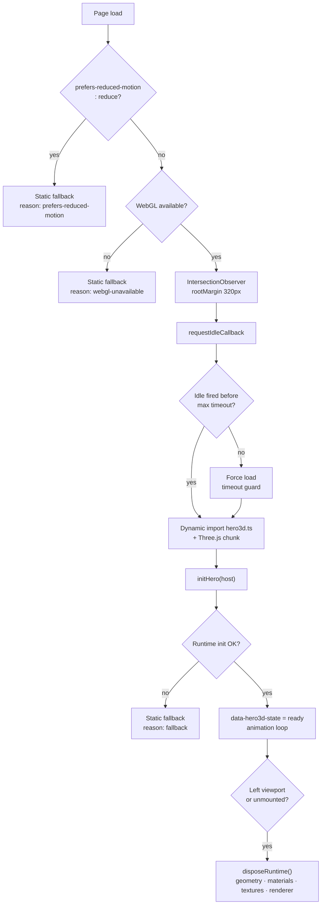
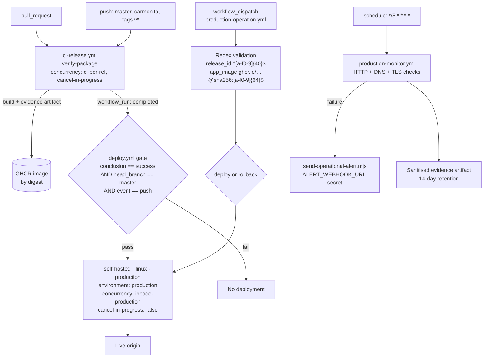

# IoCode SOLUTIONS Web — Architecture Specification

> **Scope of this document.** Every technical claim below is derived from artefacts present in the repository: `package.json`, `astro.config.mjs`, `tsconfig.json`, `playwright.config.ts`, the i18n route table, the Hero3D TypeScript modules, the GLB binary header, `compose.yml` and `compose.production.yml`, the four Dockerfiles, `Docker/node-static-server.mjs`, the Nginx configuration, and the four GitHub Actions workflows. Where the repository does **not** contain something — a `security.txt`, a contact API, a CDN layer, GLB mesh compression — this document says so explicitly rather than describing an intended state.

- **Repository:** `https://github.com/dadd86/IoCode-WEB` (branch `master`)
- **Package:** `iocode-solutions-web@0.1.0`, private
- **Production origin:** `https://iocode-solutions.com`
- **Container registry:** `ghcr.io/dadd86/iocode-solutions`
- **HEAD at audit time:** `0cc8988` — *fix(prod): align Hamburg legal and privacy contracts* (2026-08-05)
- **Spanish edition of this document:** [`docs/es/ARCHITECTURE.md`](docs/es/ARCHITECTURE.md)

---

## Table of Contents

1. [Executive Summary and Technology Matrix](#1-executive-summary-and-technology-matrix)
2. [System Topology](#2-system-topology)
3. [Frontend and Islands Architecture](#3-frontend-and-islands-architecture)
4. [3D Rendering and Performance Pipeline](#4-3d-rendering-and-performance-pipeline)
5. [Security, Headers and Regulatory Compliance](#5-security-headers-and-regulatory-compliance)
6. [Docker Infrastructure and Deployment](#6-docker-infrastructure-and-deployment)
7. [QA and Automation Strategy](#7-qa-and-automation-strategy)
8. [Known Limitations and Architectural Risks](#8-known-limitations-and-architectural-risks)

---

## 1. Executive Summary and Technology Matrix

IoCode SOLUTIONS Web is the **trilingual commercial site** for an industrial automation consultancy targeting the DACH market — PLC programming, industrial robotics, software and data engineering.

It is a **fully static site**: `output: "static"` in `astro.config.mjs`, served by a purpose-written 510-line Node HTTP server behind an Nginx TLS edge. There is no database, no session store, no login, no application cookie and no server-side rendering at request time.

### The three decisions that define this architecture

**Static-first with no backend.** The contact form composes a `mailto:` URI in the browser and hands it to the user's mail client — `window.location.assign(mailto)`. No message ever touches project infrastructure. This removes an entire class of concerns at a stroke: no form endpoint to rate-limit, no submission database to secure, no processor agreement for a form service, no GDPR data-subject rights over stored enquiries.

**CSP by per-response SHA-256 hashes.** Rather than `'unsafe-inline'` or a nonce scheme requiring dynamic rendering, the static server parses each outgoing HTML document, extracts inline `<script>` and `<style>` contents, hashes them, and injects the resulting `'sha256-…'` sources into the `Content-Security-Policy` header. This achieves a strict policy on a fully static site — documented as ADR 0004.

**Compliance as versioned data, not an environment flag.** Legal and privacy content (§5 DDG identity, privacy notice, supervisory authority) lives as final TypeScript data in `src/data/legal-profile.ts` and `src/data/legal.ts` — the same content ships in local, preview and production, with no `PUBLIC_LEGAL_*` variables gating it. Search indexing is enabled only when `PUBLIC_DEPLOY_ENV === "production"`; every other environment emits `noindex, nofollow, noarchive` and a `Disallow: /` robots policy. A production build with a wrong `PUBLIC_SITE_URL` throws during configuration rather than shipping a bad canonical.

### Technology matrix

| Layer | Technology | Version | Notes |
| --- | --- | --- | --- |
| Framework | Astro | `7.1.3` | Exact pin, `output: "static"` |
| 3D | Three.js | `0.184.0` | Exact pin — the only other runtime dependency |
| Language | TypeScript | `6.0.3` | `astro/tsconfigs/strict` + `noUncheckedIndexedAccess` |
| Type checking | `@astrojs/check` | `0.9.9` | `npm run check` |
| E2E testing | Playwright / `@playwright/test` | `1.60.0` | Both pinned exactly |
| Accessibility | axe-core | `4.10.0` | |
| Performance | Lighthouse | `12.6.1` | |
| Asset validation | gltf-validator | `^2.0.0-dev.3.10` | GLB integrity gate |
| Image pipeline | sharp | `^0.35.3` | Raster optimisation |
| Chrome driver | chrome-launcher | `^1.2.1` | |
| Node types | `@types/node` | `^26.0.0` | |
| Three types | `@types/three` | `^0.184.1` | |
| Runtime | Node.js | `24-alpine`, digest-pinned | Build and runtime images |
| Edge | Nginx | Digest-pinned via `NGINX_IMAGE` | TLS 1.2 / 1.3 |
| Orchestration | Docker Compose | v2 | 8 services across 5 profiles |
| CI/CD | GitHub Actions | 4 workflows | GHCR, self-hosted production runner |

**Runtime dependency count: two.** `astro` and `three`. Everything else is a devDependency. For a site of 38 pages with a WebGL hero, that is an unusually small production surface, and it is why `npm audit --omit=dev` can be a hard release gate rather than a source of noise.

Supply-chain controls are explicit: `.npmrc` sets `strict-allow-scripts=true`, `package.json` declares an `allowScripts` map naming exactly which packages may run install scripts (`esbuild@0.28.1` and `sharp@0.34.5` yes, `fsevents` no), and `overrides` pins `esbuild`, `yaml` and `js-yaml` transitively. A `.gitleaks.toml` allowlist scopes secret scanning to source, excluding generated artefacts.

### Repository layout

```text
IoCode-WEB/
├── astro.config.mjs                 # Static output, production URL guard
├── package.json                     # 111 scripts, 2 runtime deps
├── playwright.config.ts             # 4 browser × device projects
├── tsconfig.json                    # strict + noUncheckedIndexedAccess
├── compose.yml                      # 8 services, 5 profiles (dev/qa/preview/prod/release/assets)
├── compose.production.yml           # 2 services: app + edge, internal network
├── .gitleaks.toml                   # Secret-scanning allowlist
├── .env.example / .env.preview.example / .env.production.example
├── Docker/
│   ├── Dockerfile                   # Multi-stage production image
│   ├── Dockerfile.dev               # Dev and QA image
│   ├── Dockerfile.browser-qa        # Playwright + Lighthouse
│   ├── Dockerfile.performance       # Playwright + Chromium + gltf-transform
│   ├── node-static-server.mjs       # 510-line static server with CSP, cache tiers
│   └── scripts/                     # 10 shell + PowerShell entry points
├── infra/
│   ├── nginx/                       # nginx.conf + conf.d/default.conf
│   ├── logrotate/
│   └── systemd/
├── src/
│   ├── assets/                      # 5 CSS files: tokens, global, components, pages, hero3d
│   ├── components/                  # 20 .astro components
│   ├── config/                      # environment.ts, legal.ts
│   ├── data/                        # 10 content modules
│   ├── i18n/                        # config.ts, routes.ts, ui.ts
│   ├── layouts/BaseLayout.astro
│   ├── pages/                       # [locale]/[...slug] + localized 404/500 + robots/sitemap
│   ├── scripts/                     # hero3d.ts, hero3d-loader.ts, page-control.ts
│   └── types/                       # Ambient declarations
├── public/logo/3d/*.glb             # 168 KB hero model
├── tests/
│   ├── e2e/                         # 17 Playwright specs
│   ├── unit/                        # 9 node:test suites
│   └── fixtures/                    # doc-validator and env-parity fixtures
├── tools/                           # 88 QA, release and operations scripts
├── docs/                            # 47 documents including 6 ADRs
└── .github/workflows/               # 4 workflows
```

---

## 2. System Topology

### 2.1 Build-to-runtime data flow



There is **no CDN or edge cache layer**. The Nginx container is the only network hop in front of the origin, and both run on the same host. Cache control is asserted by the origin through `Cache-Control` headers and honoured by browsers, not by an intermediary. See §8.6.

### 2.2 Request lifecycle



### 2.3 Compose service map

`compose.yml` defines eight services across five profiles. Only `dev` runs without a profile flag.

| Service | Profile | Image source | Purpose |
| --- | --- | --- | --- |
| `dev` | *(default)* | `Dockerfile.dev` | Astro dev server on `:4321`, bind-mounted source |
| `qa` | `qa` | `Dockerfile.dev` | `astro check` + build + production audit, with the full legal env matrix |
| `preview` | `preview` | `Dockerfile.dev` | `build:preview` + `astro preview` on `:4322` |
| `web` | `prod` | `Dockerfile` | Production image on `:8080`, hardened |
| `browser-qa` | `qa` | `Dockerfile.browser-qa` | Playwright + Lighthouse against `http://web:8080` |
| `performance-qa` | `qa` | `Dockerfile.performance` | Phase-6 budgets, Chromium, digest-pinned Playwright base |
| `release-tools` | `release` | `Dockerfile.dev` | Release manifest and documentation gates |
| `assets` | `assets` | `Dockerfile.performance` | `gltf-transform` for GLB work |

Both QA services declare `depends_on: web: condition: service_healthy`, so tests never race a cold origin.

---

## 3. Frontend and Islands Architecture

### 3.1 Hydration model: zero islands, three hand-written modules

This is the point where the codebase diverges most sharply from a conventional Astro project, and the divergence is deliberate.

There is **no UI framework integration**. No React, Vue, Svelte, Preact or Solid appears in `package.json` or `astro.config.mjs`. All 20 components are `.astro` files, which compile away entirely at build time. Consequently **no `client:*` hydration directive exists anywhere in the source** — there are no islands to hydrate.

Client-side behaviour is delivered by exactly three hand-written TypeScript modules:

| Module | Lines | Responsibility |
| --- | --- | --- |
| `src/scripts/hero3d-loader.ts` | — | Progressive activation gate for the 3D hero |
| `src/scripts/hero3d.ts` | 1,072 | Three.js scene, animation loop, disposal |
| `src/scripts/page-control.ts` | — | Page-level UI control |

The trade-off is explicit: no component-level interactivity abstraction, at the cost of writing DOM code by hand — in exchange for a JavaScript baseline that is essentially the hero loader alone, with Three.js fetched only on demand. The performance budget in §4.3 caps the hero loader's initial payload at **12,000 bytes raw / 5,000 bytes gzipped**, which is only achievable because there is no framework runtime underneath it.

### 3.2 Routing and i18n

Three locales, Spanish as default:

```typescript
export type Locale = "es" | "en" | "de";
export const locales: Locale[] = ["es", "en", "de"];
export const defaultLocale: Locale = "es";
```

`src/i18n/routes.ts` declares a `routeAlternates` table keyed by eleven `RouteKey` values — `home`, `services`, `plc`, `robotics`, `about`, `projects`, `skills`, `process`, `contact`, `imprint`, `privacy`. Each key carries a label, a slug and a full path per locale:

```typescript
plc: {
  key: "plc",
  label: { es: "PLC", en: "PLC", de: "SPS" },
  slug: { es: "automatizacion-plc", en: "plc-automation", de: "sps-automatisierung" },
  path: { es: "/es/automatizacion-plc/", en: "/en/plc-automation/", de: "/de/sps-automatisierung/" }
}
```

**Slugs are localised, not transliterated.** A German visitor searching *SPS-Automatisierung* lands on `/de/sps-automatisierung/`, not on a German page sitting at an English URL. For a DACH-market site where "SPS" and "PLC" are genuinely different search terms, this is the difference between ranking and not ranking. ADR 0002 records the route-key decision.

German slugs use ASCII transliteration where the label carries an umlaut — `faehigkeiten` for *Fähigkeiten* — avoiding percent-encoded URLs in shared links.

Because every route key resolves to all three paths from one table, `hreflang` alternates and the language switcher are derived from a single source of truth rather than maintained separately. A missing translation is a TypeScript error, not a broken link discovered in production. `tests/unit/i18n-contract.test.mjs` enforces the table's completeness.

Routing is implemented as a single dynamic catch-all, `src/pages/[locale]/[...slug].astro`, plus localised `404` and `500` pages per language and global fallbacks. `trailingSlash: "always"` is set in `astro.config.mjs` and reflected consistently in the path table.

### 3.3 Generated SEO surfaces

| Route | Implementation | Behaviour |
| --- | --- | --- |
| `/robots.txt` | `src/pages/robots.txt.ts` | Environment-dependent |
| `/sitemap.xml` | `src/pages/sitemap.xml.ts` | Generated from the route table |
| `/sitemap-index.xml` | `src/pages/sitemap-index.xml.ts` | Index referencing the sitemap |

`robots.txt` is not a static file. Outside production it emits `User-agent: *\nDisallow: /`. In production it emits an explicit allowlist that names AI crawlers individually — `OAI-SearchBot`, `ChatGPT-User`, `PerplexityBot`, `Perplexity-User`, `Claude-SearchBot`, `Claude-User`, `GPTBot`, `ClaudeBot`, `Google-Extended` — each `Allow: /`, followed by both sitemap references. ADR 0005 records this as a deliberate AI-crawler policy: for a consultancy, being cited by an assistant is lead generation, so the permission is stated rather than left to a wildcard's ambiguity.

### 3.4 Styling and content

Five CSS files under `src/assets/`, layered by scope: `tokens.css` (design tokens), `global.css`, `components.css`, `pages.css`, `hero3d.css`. No Tailwind, no CSS-in-JS, no PostCSS plugin chain. The total CSS budget is capped at 120,000 bytes.

Content lives in ten typed TypeScript modules under `src/data/` — `site`, `navigation`, `pageContent`, `projects`, `skills`, `contact`, `legal`, `heroPanels`, `processSections`, `phase1Sections`. Content is therefore type-checked and refactorable, at the cost of requiring a rebuild to change copy. There is no CMS and no content collection.

---

## 4. 3D Rendering and Performance Pipeline

### 4.1 Progressive activation

`hero3d-loader.ts` states its strategy in its own header comment: verify reduced motion and WebGL, observe viewport proximity, request load during an idle period, and apply a maximum timeout so that Android and iOS cannot remain indefinitely deferred.



The `HERO_PRELOAD_MARGIN_PX = 320` constant starts the fetch 320 pixels before the hero enters the viewport, so the model is typically ready by the time it is visible.

Fallback reasons are a closed union type — `"prefers-reduced-motion" | "webgl-unavailable" | "fallback"` — mapped to translation keys. A user on a device without WebGL sees a localised explanation, not a blank rectangle. State is surfaced on the DOM as `data-hero3d-state` and `data-fallback`, which is what makes the resilience path testable from Playwright (§7.2).

### 4.2 Runtime adaptivity and disposal

`hero3d.ts` adapts to the device rather than rendering one fixed scene:

- **Pixel ratio clamping.** A `pixelRatioLimit` bounds `devicePixelRatio`, preventing a 3× retina display from quadrupling fragment work for no perceptible gain.
- **Coarse-pointer detection.** `window.matchMedia("(pointer: coarse)")` distinguishes touch devices and adjusts interaction accordingly.
- **Colour-scheme awareness.** `(prefers-color-scheme: dark)` is queried and observed, so the scene follows the system theme rather than being locked to one palette.
- **Reduced-motion re-check at runtime.** The media query is observed inside the scene, not only at the loader gate.
- **Explicit GPU resource disposal.** `disposeObject3D` walks the scene graph disposing geometries; `disposeMaterial` disposes each material's textures before the material itself; `state.renderer?.dispose()` releases the context. A `disposed` flag guards against double-disposal and against the animation loop resuming after teardown.

The disposal path is the detail that distinguishes production WebGL from demo WebGL. Three.js does not garbage-collect GPU memory — an undisposed texture leaks until the context is lost, and on mobile Safari a leaked context is a crashed tab.

### 4.3 Performance budgets

These are enforced as environment variables on the `performance-qa` service in `compose.yml`, not as advisory targets.

| Budget | Threshold | Variable |
| --- | --- | --- |
| GLB ideal | 250,000 bytes | `PHASE6_MAX_GLB_IDEAL_BYTES` |
| GLB accepted | 500,000 bytes | `PHASE6_MAX_GLB_ACCEPTED_BYTES` |
| GLB blocker | 500,000 bytes | `PHASE6_MAX_GLB_BLOCKER_BYTES` |
| Any image | 350,000 bytes | `PHASE6_MAX_IMAGE_BYTES` |
| Critical logo | 180,000 bytes | `PHASE6_MAX_CRITICAL_LOGO_BYTES` |
| Small logo | 90,000 bytes | `PHASE6_MAX_SMALL_LOGO_BYTES` |
| Initial JS | 250,000 bytes | `PHASE6_MAX_JS_INITIAL_BYTES` |
| Total JS | 700,000 bytes | `PHASE6_MAX_JS_TOTAL_BYTES` |
| Total CSS | 120,000 bytes | `PHASE6_MAX_CSS_TOTAL_BYTES` |
| Hero loader initial | 12,000 bytes | `PHASE6_MAX_HERO_LOADER_INITIAL_BYTES` |
| Hero loader initial, gzipped | 5,000 bytes | `PHASE6_MAX_HERO_LOADER_INITIAL_GZIP_BYTES` |
| Three.js runtime, gzipped | 190,000 bytes | `PHASE6_MAX_THREE_RUNTIME_GZIP_BYTES` |
| Lighthouse desktop | ≥ 0.90 | `PHASE6_MIN_LIGHTHOUSE_DESKTOP` |
| Lighthouse mobile | ≥ 0.75 | `PHASE6_MIN_LIGHTHOUSE_MOBILE` |
| LCP | ≤ 2,500 ms | `PHASE6_MAX_LCP_MS` |
| CLS | ≤ 0.1 | `PHASE6_MAX_CLS` |
| TBT | ≤ 300 ms | `PHASE6_MAX_TBT_MS` |

The LCP, CLS and TBT thresholds are exactly the Core Web Vitals "good" boundaries. The separate desktop and mobile Lighthouse floors acknowledge that a WebGL hero cannot score identically on both.

The `browser-qa` service carries a second, looser set — `LH_MIN_PERFORMANCE: 0.50`, `LH_MIN_ACCESSIBILITY: 1`, `LH_MIN_BEST_PRACTICES: 0.85`, `LH_MIN_SEO: 1` — plus an accessibility-performance group (`A11Y_PERF_*`) with `MIN_ACCESSIBILITY: 1`, `MIN_SEO: 1`, `MIN_BEST_PRACTICES: 0.95` and asset ceilings of 700 KB JS, 120 KB CSS, 8 MB GLB, 2 MB images.

**Accessibility is required to be a perfect 1.0** in both groups. That is a stricter gate than most commercial sites apply to themselves.

### 4.4 The GLB asset

| Property | Value |
| --- | --- |
| Path | `public/logo/3d/iocode_solutions_logo_extruded_3d.glb` |
| Size | 168,812 bytes |
| Generator | `IoCode Phase 6 alpha-safe billboard generator` |
| `extensionsUsed` | none |
| `extensionsRequired` | none |
| Meshes / materials / accessors | 1 / 1 / 3 |

**The model carries no Draco or meshopt compression.** `extensionsUsed` is absent from the glTF header, so neither `KHR_draco_mesh_compression` nor `EXT_meshopt_compression` is present. At 168 KB against a 250 KB ideal budget the asset passes comfortably without it, and a single-mesh, single-material billboard is precisely the geometry class where Draco's decoder cost can exceed its transfer saving. The decision is defensible; §8.3 records the margin it leaves.

Asset integrity is nevertheless enforced: `gltf-validator` runs in `internal:qa:assets:6`, and `internal:qa:logo3d-version:6` verifies a cache-busting version token. The static server's cache tier for `.glb` is conditional on that token — a `?v=` parameter matching `^[a-f0-9]{12,64}$` earns `max-age=31536000, immutable`; without it the asset gets `max-age=3600, must-revalidate`. An unversioned model therefore cannot be cached immutably by mistake.

---

## 5. Security, Headers and Regulatory Compliance

### 5.1 Content Security Policy by response hash

`createCspHeader(html)` in `Docker/node-static-server.mjs` computes the policy per response:

```javascript
function createCspHeader(html = "") {
  const scriptHashes = extractInlineScriptContents(html).map(createSha256Source);
  const styleHashes = extractInlineStyleContents(html).map(createSha256Source);

  const cspDirectives = [
    "default-src 'self'",
    "base-uri 'self'",
    "object-src 'none'",
    "frame-ancestors 'none'",
    "form-action 'self' mailto:",
    ["script-src", "'self'", ...scriptHashes].join(" "),
    "script-src-attr 'none'",
    ["style-src", "'self'", ...styleHashes].join(" "),
    "style-src-attr 'none'",
    "img-src 'self' data: blob:",
    "font-src 'self' data:",
    "connect-src 'self' blob:",
    "manifest-src 'self'",
    "media-src 'self' blob:",
    "worker-src 'self' blob:"
  ];

  if (enableUpgradeInsecureRequests) {
    cspDirectives.push("upgrade-insecure-requests");
  }

  return cspDirectives.join("; ");
}
```

`extractInlineScriptContents` skips any `<script>` carrying a `src` attribute — external scripts are covered by `'self'`, not by a hash — and skips empty bodies, which would otherwise contribute a useless hash.

Four directives deserve specific attention:

- **`script-src-attr 'none'` and `style-src-attr 'none'`** block inline event handlers (`onclick="…"`) and inline `style` attributes outright. Most CSP configurations omit these and leave a live XSS vector open.
- **`form-action 'self' mailto:'`** permits exactly the one external destination the contact form actually uses.
- **`object-src 'none'`** and **`frame-ancestors 'none'`** close plugin embedding and clickjacking.
- **`blob:` in `connect-src`, `media-src` and `worker-src`** is required by Three.js for its internal object URLs — a targeted allowance rather than a blanket one.

`upgrade-insecure-requests` is conditional on `ENABLE_UPGRADE_INSECURE_REQUESTS`, set to `"true"` only in `compose.production.yml`.

### 5.2 The full header set

Applied by `setSecurityHeaders()` on every response:

| Header | Value | Condition |
| --- | --- | --- |
| `Content-Security-Policy` | Per §5.1 | Always |
| `X-Content-Type-Options` | `nosniff` | Always |
| `X-Frame-Options` | `DENY` | Always |
| `X-DNS-Prefetch-Control` | `off` | Always |
| `X-Permitted-Cross-Domain-Policies` | `none` | Always |
| `Referrer-Policy` | `strict-origin-when-cross-origin` | Always |
| `Cross-Origin-Resource-Policy` | `same-origin` | Always |
| `Origin-Agent-Cluster` | `?1` | Always |
| `Permissions-Policy` | `camera=(), microphone=(), geolocation=(), payment=(), usb=(), serial=()` | Always |
| `Cross-Origin-Opener-Policy` | `same-origin` | `ENABLE_COOP` |
| `Strict-Transport-Security` | `max-age=31536000; includeSubDomains` | `ENABLE_HSTS` |

**HSTS is deliberately disabled at the application layer in production** (`ENABLE_HSTS: "false"` in `compose.production.yml`) and emitted by the Nginx edge instead. This is correct: the origin speaks plain HTTP on an internal Docker network, so it has no business asserting a transport policy it cannot see. Anyone "fixing" this by enabling it in the app would produce a duplicated header.

### 5.3 Cache tiers

`getCacheControl()` assigns by path, and the tiering is unusually careful:

| Path pattern | Directive |
| --- | --- |
| Any non-200 response | `no-cache, max-age=0, must-revalidate` |
| `/health` | `no-store` |
| `*.xml`, `robots.txt` | `public, max-age=3600` |
| `/_astro/*` | `public, max-age=31536000, immutable` |
| `*.glb` with valid `?v=` hex token | `public, max-age=31536000, immutable` |
| `*.glb` without token | `public, max-age=3600, must-revalidate` |
| Other assets | `public, max-age=604800, stale-while-revalidate=86400` |
| Everything else, including HTML | `no-cache, max-age=0, must-revalidate` |

Astro's `/_astro/` output is content-hashed, so immutable caching is safe there. HTML is never cached, which means a redeploy is visible immediately. Weak ETags are computed from size and mtime.

Compression is negotiated per response: Brotli when the client accepts `br`, gzip otherwise, and nothing for content types outside the compressible set. Compression happens at the origin; **Nginx has neither `gzip` nor `brotli` enabled**, which avoids double-compression.

### 5.4 Edge hardening

`infra/nginx/conf.d/default.conf` defines three server blocks:

- **`:8080` plain HTTP** → `return 308` to the HTTPS apex for everything except `/nginx-health`.
- **`:8443` TLS for `www.`** → `return 308` to the apex. The `www` host gets a real certificate purely so the redirect is reachable over HTTPS without a warning.
- **`:8443` TLS for the apex** → the actual proxy, with `limit_req zone=site_per_ip burst=40 nodelay` over a `20r/s` zone, `proxy_http_version 1.1`, keepalive upstream, and forwarded headers including a per-request `X-Request-ID`.

TLS is restricted to `TLSv1.2 TLSv1.3` with `ssl_session_tickets off`. Certificates arrive as Docker secrets at `/run/secrets/tls_fullchain` and `/run/secrets/tls_privkey` — mounted, never baked into an image. `server_tokens off` and `client_max_body_size 1m` are set globally.

### 5.5 Build-time environment guards

Two independent guards run at configuration time, one in `astro.config.mjs` and one in `src/config/environment.ts`:

```typescript
if (!allowedEnvironments.has(rawEnvironment as DeployEnvironment)) {
  throw new Error(`PUBLIC_DEPLOY_ENV no válido: ${rawEnvironment}`);
}

if (
  deployEnvironment === "production" &&
  (siteUrl !== productionSiteUrl || parsedSiteUrl.protocol !== "https:")
) {
  throw new Error(`PUBLIC_SITE_URL debe ser exactamente ${productionSiteUrl} en producción.`);
}
```

A production build with a staging URL, an HTTP scheme or a typo does not produce a subtly wrong canonical — it fails.

Indexing follows from the same variable:

```typescript
export const allowSearchIndexing = deployEnvironment === "production";
export const defaultRobotsDirective = allowSearchIndexing
  ? "index, follow, max-image-preview:large"
  : "noindex, nofollow, noarchive";
```

A preview deployment cannot be indexed by accident. That is one of the most common and most expensive SEO mistakes, closed structurally.

### 5.6 Regulatory compliance — DACH and EU

**§5 DDG (Impressum).** Imprint content is defined directly in `src/data/legal-profile.ts` — legal name, trading designation, legal form, service address, phone, email and VAT ID — a versioned TypeScript object covering exactly the §5 DDG mandatory fields, with no representative or register fields because none exist (sole proprietorship, not entered in the commercial register).

**GDPR Article 13 (privacy notice).** `config/privacy-governance.json` records the processors actually under contract — Hetzner Online GmbH (hosting) and Zoho Corporation B.V. (email) — with their Article 28 DPA, processing location and transfer mechanism where relevant; both carry `productionGate: "ready"` and `controllerApproval: "approved"`. DNS/CDN and the domain registrar are documented as out of scope (`outOfScopeProviders`) because they process domain-administration data, not visitor personal data.

**TDDDG §25 (cookie consent).** Not triggered. There is no cookie, no local storage of personal data, no analytics, no tag manager and no third-party embed. §25 requires consent for storing or accessing information on terminal equipment; nothing here does so, and therefore no consent banner is required. The absence of a CMP is the correct outcome of the architecture, not an oversight.

**Contact processing.** `mailto:` composition means enquiry data never reaches project infrastructure. `docs/ROPA_INVENTORY.md`, `docs/PROCESSOR_DPA_REGISTER.md` and `docs/PRIVACY_OPERATIONS.md` maintain the Article 30 record, processor register and operational procedures.

Governance is machine-readable in `config/privacy-governance.json` and `config/observability.json`, and `tests/e2e/phase-9f-legal-privacy.spec.ts` plus `tests/unit/phase-9f-contract.test.mjs` assert the legal surface automatically.

**`security.txt` (RFC 9116) is absent.** `SECURITY.md` exists at the repository root, but no `/.well-known/security.txt` is served. See §8.2.

---

## 6. Docker Infrastructure and Deployment

### 6.1 Production image

`Docker/Dockerfile` is a two-stage build on a digest-pinned `node:24-alpine`. The digest pin matters: a tag can be re-pointed, a digest cannot.

The build stage receives 30 `ARG` values covering deployment, legal and privacy configuration, promotes them to `ENV` so Astro can read them, installs with `npm ci`, then runs `npm run check` **and** `npm run build`. Type checking is inside the image build — an image that compiles is an image that type-checks.

The runtime stage copies only `dist/` and `node-static-server.mjs`. No `node_modules`, no source, no build tooling. It sets OCI labels including `org.opencontainers.image.revision`, `com.iocode.release.artifact.name` and `com.iocode.release.artifact.sha256`, then drops to `USER node`.

### 6.2 Production runtime hardening

`compose.production.yml` defines two services on an `internal: true` network.

| Control | `app` | `edge` |
| --- | --- | --- |
| Image | `${APP_IMAGE:?…}` — required, digest expected | `${NGINX_IMAGE:?…}` — required |
| User | `1000:1000` | `101:101` |
| Filesystem | `read_only: true` | `read_only: true` |
| Writable area | `tmpfs /tmp rw,noexec,nosuid,nodev,size=16m` | `tmpfs /tmp` 32m, same flags |
| Privilege escalation | `no-new-privileges:true` | `no-new-privileges:true` |
| Capabilities | `cap_drop: ALL` | `cap_drop: ALL` |
| CPU | `0.50` | `0.50` |
| Memory | `256m` limit / `64m` reservation | `128m` / `32m` |
| PIDs | `100` | `100` |
| Network exposure | `expose: 8080` — internal only | `ports: 80, 443` |
| Logging | `local` driver, 10 MB × 3, compressed | same |

The `:?` syntax on `APP_IMAGE` and `NGINX_IMAGE` makes Compose refuse to start without them, so production cannot accidentally run a locally built or `:latest` image.

`edge` declares `depends_on: app: condition: service_healthy`, so no request reaches the proxy before the origin is verified healthy. The `app` healthcheck is a real HTTP request to `/health` asserting a 200 status, not a port probe.

The `tmpfs` flags are worth noting individually: `noexec` prevents executing anything written to `/tmp`, `nosuid` neutralises setuid bits, `nodev` blocks device nodes, and `uid`/`gid` match the container user so the mount is usable without loosening permissions.

### 6.3 CI/CD

Four workflows, each with a single responsibility.



Three details make this pipeline stronger than most:

**Deployment cannot be triggered directly.** `deploy.yml` fires on `workflow_run` completion and re-checks three conditions — CI succeeded, the branch was `master`, and the event was a push. A green CI run on a pull request or a feature branch cannot reach production.

**Manual operations are regex-validated.** `production-operation.yml` accepts `deploy` or `rollback` and validates that `release_id` is a 40-character hex SHA and `app_image` matches `^ghcr\.io/dadd86/iocode-solutions@sha256:[a-f0-9]{64}$`. A tag, a `:latest`, or a truncated digest is rejected before anything runs. Rollback is a first-class operation with the same rigour as deployment.

**Concurrency is scoped by intent.** CI uses `cancel-in-progress: true` — superseded builds are wasted work. Production uses `cancel-in-progress: false` under a shared `iocode-production` group — a deployment interrupted halfway is a broken site, so operations queue instead.

Monitoring runs every five minutes with `continue-on-error: true`, so a failed probe raises an alert rather than failing the workflow, and evidence is uploaded with `if-no-files-found: error` so a silently missing report is itself a failure.

Deployment supporting scripts live in `tools/`: `deploy-release.sh`, `rollback-release.sh`, `post-deploy-smoke.sh`, `create-release-manifest.mjs`, `inspect-release-zip.mjs`, `prune-observability-logs.sh`.

---

## 7. QA and Automation Strategy

### 7.1 Test matrix

`playwright.config.ts` defines four projects:

| Project | Device | Engine | Viewport |
| --- | --- | --- | --- |
| `chromium-desktop` | Desktop Chrome | Chromium | 1366 × 900 |
| `chromium-mobile` | Pixel 5 | Chromium | Device default |
| `webkit-iphone` | iPhone 13 | WebKit | Device default |
| `webkit-ipad` | iPad Pro 11 | WebKit | Device default |

The config documents its own reasoning: Chrome on iOS runs WebKit, so `webkit-iphone` is the correct automated approximation for detecting engine-specific regressions on the real device.

Determinism is prioritised over speed — `fullyParallel: false`, `retries: 0`, `forbidOnly` in CI. Zero retries means a flake is a failure, which is the honest setting; the trade-off is longer runs and no tolerance for genuine environmental noise. A dedicated flake detector exists separately: `internal:qa:phase-9d:flaky` runs `--repeat-each=3 --workers=1` and analyses the result.

Diagnostics are retained only on failure — `trace`, `screenshot` and `video` all on `retain-on-failure` — keeping artefact volume proportional to problems.

### 7.2 Test inventory

**17 Playwright E2E specs** covering visual regression, SEO, accessibility and performance, projects, skills, contact conversion, UI accessibility, hero cross-platform, hero iOS, hero performance, responsive pages, production behaviour, hero resilience, production smoke, legal and privacy, services responsiveness, and page control.

`phase-9c-hero-resilience.spec.ts` runs across all four projects and is the reason the `data-hero3d-state` and `data-fallback` attributes exist: the fallback path is asserted, not assumed.

**9 unit suites** using the native `node:test` runner with no test framework dependency: `doc-validator`, `check-env-parity`, `i18n-contract`, `page-control-contract`, `phase-9a-contract`, `phase-9e-contract`, `phase-9f-contract`, `prod-ready-contract`, `r3-5b-script-contract`.

Several of these are **contract tests over configuration rather than code** — `check-env-parity` verifies that `.env` examples and `compose.yml` declare the same variables, with dedicated valid and invalid fixtures. Environment drift between a documented example and actual orchestration is a classic production incident, and here it is a test failure instead.

The `doc-validator` tool has its own fixture suite covering invalid fences, invalid metadata, mojibake detection, command-link validation and runtime-policy checks across `.astro`, `.css`, `.js`, `.mjs`, `.ps1` and `Dockerfile` inputs. Documentation is linted with the same seriousness as code.

### 7.3 Gate composition

`package.json` declares 111 scripts. They follow a three-namespace convention:

| Prefix | Meaning |
| --- | --- |
| `internal:` | Active gates in current use |
| `historical:` | Phase-specific gates retained as evidence |
| `docker:` | Thin wrappers invoked from inside containers |

Composite gates chain granular steps. `internal:qa:phase-6` runs check → typecheck source → typecheck tests → clean → prepare assets → build → audit → budgets → raster → bundle → headers → hero review → hero runtime → hero cross-platform → services responsive → responsive visual → hero iOS → Lighthouse → summary. Nineteen steps in one command, each independently runnable when one fails.

`internal:qa:phase-9d:predeploy` is the pre-deployment gate: `check`, `typecheck:src`, `typecheck:tests`, `build`, `audit:prod:strict`.

Note that `tsconfig.json` excludes `tests/`, and the test tree has its own `tests/e2e/tsconfig.json`. Both are type-checked, by separate scripts — source and tests do not share a compiler configuration, and neither is skipped.

---

## 8. Known Limitations and Architectural Risks

This project is markedly more mature than a typical static marketing site. The findings below are refinements, not defects that break the build — with one documentation-structure conflict that must be resolved before these deliverables are committed.

### 8.1 Deliverable path collision with existing documentation

`docs/ARCHITECTURE.md` already exists — 157 lines, written in Spanish, carrying the project's own `Bloque / Descripción / Ámbito / Idiomas afectados / Origen de datos / Última verificación` control header and marked verified `2026-07-28`.

The requested deliverable layout places an English specification at the repository root and a Spanish one at `docs/es/ARCHITECTURE.md`. Committing both without a decision produces two Spanish architecture documents in the same tree, and `tools/doc-validator.js` enforces the metadata header that this document does not carry.

**Recommendation:** either (a) retire `docs/ARCHITECTURE.md` in favour of the new pair, adding the control header to both so `internal:docs:lint` passes, or (b) keep the existing document as the canonical short-form entry and place the new pair under `docs/reference/`. Do not leave both as-is.

### 8.2 `security.txt` (RFC 9116) is not served

`SECURITY.md` exists at the repository root, but no `/.well-known/security.txt` is generated or served. For a site that already ships eleven security headers, a hash-based CSP and a gitleaks configuration, the omission stands out — RFC 9116 is the standard mechanism by which a researcher who finds something reports it to you rather than to someone else.

The route infrastructure to add it already exists: `src/pages/robots.txt.ts` demonstrates the pattern for a generated text response, and the `Expires` field can be derived at build time.

### 8.3 GLB compression leaves no headroom

At 168,812 bytes the model sits comfortably under the 250,000-byte ideal budget without any mesh compression, and for a single-mesh billboard that is a reasonable call — Draco's decoder cost can exceed its transfer saving at this scale.

The risk is directional rather than current. Any richer model — a second mesh, a real extrusion, a texture — crosses 250 KB quickly, and at that point compression must be introduced under time pressure rather than deliberately. The tooling is already present: `gltf-transform` is available in the `assets` service profile.

### 8.4 Two conflicting Lighthouse performance floors

`browser-qa` sets `LH_MIN_PERFORMANCE: 0.50` while `performance-qa` sets `PHASE6_MIN_LIGHTHOUSE_DESKTOP: 0.90` and `PHASE6_MIN_LIGHTHOUSE_MOBILE: 0.75`. Both services run under the `qa` profile against the same origin.

Which threshold gates a release depends on which script is invoked, and nothing in the repository states the precedence. The 0.50 floor is loose enough to pass a build that the 0.90 gate would reject. Document the intent — presumably `browser-qa` is a broad smoke check and `performance-qa` is the release gate — or align the values.

### 8.5 Inconsistent dependency pinning

`astro`, `three`, `typescript`, `playwright`, `@playwright/test`, `axe-core` and `lighthouse` are pinned exactly. `@types/node`, `@types/three`, `sharp`, `chrome-launcher` and `gltf-validator` use caret ranges.

Given that this project pins Docker images by digest, forbids install scripts by default and treats `npm audit --omit=dev` as a release gate, the caret ranges are the weakest link in an otherwise tight supply chain. `gltf-validator` at `^2.0.0-dev.3.10` is additionally a pre-release version under a caret range, which is the least predictable combination available.

Note also that `allowScripts` permits `sharp@0.34.5` while `devDependencies` requests `sharp@^0.35.3`. The allowlist entry names a version the manifest will not install, so the permission is either stale or ineffective — worth reconciling, since the whole point of the mechanism is that it is exact.

### 8.6 No CDN or edge cache layer

The Nginx container and the origin run on the same host. Cache-Control headers are well-designed, but there is no intermediary honouring them — every cache miss and every first-time visitor is served from a single origin with `cpus: 0.50` and `mem_limit: 256m`.

For a static site of 38 pages that is adequate, and the tight resource limits are themselves a deliberate blast-radius control. But global latency is bounded by one German host, and there is no absorption layer in front of a traffic spike beyond the `20r/s` per-IP rate limit. If the site becomes a lead source, a CDN in front of the existing headers would be a low-effort improvement — the cache tiers are already correct for it.

### 8.7 Personal branch in the production CI trigger list

`ci-release.yml` triggers on pushes to `master` and `carmonita`. `deploy.yml` correctly filters `head_branch == 'master'`, so `carmonita` cannot reach production — the safety is real.

Still, a personal branch name in a production pipeline's trigger list is the kind of thing that survives long past its purpose and confuses the next reader. Either rename it to something role-descriptive or move it to a pattern such as `feature/**`.

### 8.8 Legal defaults embedded in orchestration (resolved 2026-09-05)

`compose.yml` and `Docker/Dockerfile` used to carry fallback values for the Impressum via `PUBLIC_LEGAL_*`/`PUBLIC_PRIVACY_*` variables, with publication gated on `PUBLIC_LEGAL_APPROVED`/`PUBLIC_PRIVACY_APPROVED`. The real failure mode: a build with a missing or misconfigured environment could silently ship a legally binding Impressum populated from defaults rather than failing.

Legal review completed: §5 DDG and privacy-notice content are now final TypeScript data in `src/data/legal-profile.ts` and `src/data/legal.ts`, versioned in Git like any other site content. There is no build path that can ship an Impressum populated from defaults, because there are no defaults left — only the approved content. `compose.yml` and `Docker/Dockerfile` no longer declare any `PUBLIC_LEGAL_*`/`PUBLIC_PRIVACY_*` variable.

### 8.9 Script surface area

111 npm scripts, 88 files in `tools/`, and 47 documents in `docs/`. The `internal:` / `historical:` / `docker:` naming convention keeps this navigable, and the `historical:` prefix is an honest way to retain phase evidence without pretending it is current.

The maintenance cost is nonetheless real: every `historical:` script references `tools/*-phase-*.mjs` files that must keep working or be removed, and a newcomer faces a 111-entry script list. Consider moving closed-phase scripts to `tools/historical/` and their npm entries to a separate documented runner, so the active gate list is short enough to read.

---

## Appendix A — Repository inventory

| Category | Count |
| --- | --- |
| Astro components | 20 |
| Client TypeScript modules | 3 |
| CSS files | 5 |
| Content data modules | 10 |
| i18n modules | 3 |
| Route keys | 11 |
| Locales | 3 (es, en, de) |
| Localised content routes | 33 |
| Total generated pages | 38 |
| Runtime dependencies | 2 |
| Dev dependencies | 11 |
| npm scripts | 111 |
| Tools scripts | 88 |
| Playwright E2E specs | 17 |
| Unit test suites | 9 |
| Playwright projects | 4 |
| Dockerfiles | 4 |
| Compose services (dev/QA) | 8 |
| Compose services (production) | 2 |
| GitHub Actions workflows | 4 |
| Documentation files | 47 |
| Architecture decision records | 6 |
| Security response headers | 11 |
| CSP directives | 14–15 |

## Appendix B — Architecture decision records

| ADR | Title |
| --- | --- |
| 0001 | Static-first runtime |
| 0002 | Route-key i18n |
| 0003 | Progressive Hero3D |
| 0004 | CSP response hashes |
| 0005 | AI crawler policy |
| 0006 | Production hosting |

## Appendix C — Environment variables

| Group | Variables |
| --- | --- |
| Deployment | `PUBLIC_DEPLOY_ENV`, `PUBLIC_SITE_URL` |
| Imprint (§5 DDG) | Versioned public content in `src/data/legal-profile.ts` and `src/data/legal.ts`; no environment variable or deployment override |
| Privacy (GDPR Art. 13) | Processors and transfers declared in `config/privacy-governance.json` (`controllerApproval: "approved"`) |
| Runtime headers | `ENABLE_HSTS`, `ENABLE_COOP`, `ENABLE_UPGRADE_INSECURE_REQUESTS` |
| Runtime | `NODE_ENV`, `PORT`, `ASTRO_TELEMETRY_DISABLED` |
| Local ports | `ASTRO_DEV_PORT`, `ASTRO_PREVIEW_PORT`, `WEB_PORT`, `CHOKIDAR_USEPOLLING` |
| Production deploy | `APP_IMAGE`, `NGINX_IMAGE`, `TLS_FULLCHAIN_PATH`, `TLS_PRIVKEY_PATH` |
| QA base URLs | `PLAYWRIGHT_BASE_URL`, `LIGHTHOUSE_BASE_URL`, `SECURITY_BASE_URL`, `DEVOPS_BASE_URL`, `PERFORMANCE_BASE_URL`, `A11Y_PERF_BASE_URL` |
| Budgets | `PHASE6_*` (17 variables), `LH_MIN_*` (4), `A11Y_PERF_*` (7) |
| Alerting | `ALERT_WEBHOOK_URL` |
