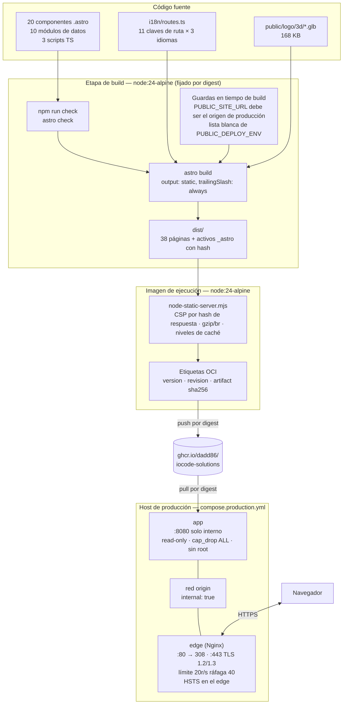
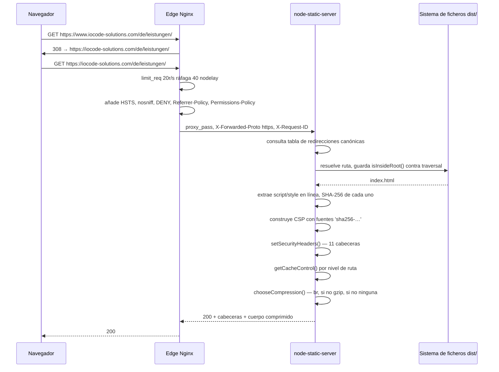
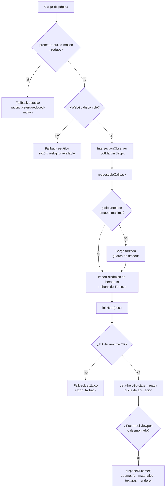
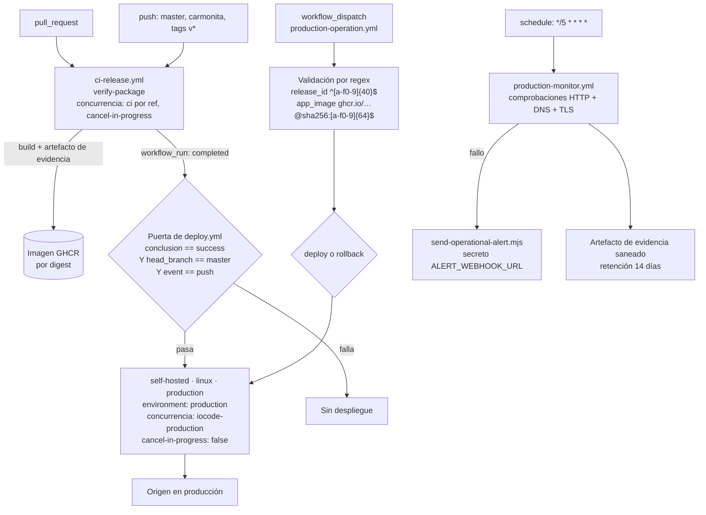

# IoCode SOLUTIONS Web — Especificación de Arquitectura

> **Alcance de este documento.** Toda afirmación técnica que sigue se deriva de artefactos presentes en el repositorio: `package.json`, `astro.config.mjs`, `tsconfig.json`, `playwright.config.ts`, la tabla de rutas i18n, los módulos TypeScript de Hero3D, la cabecera binaria del GLB, `compose.yml` y `compose.production.yml`, los cuatro Dockerfiles, `Docker/node-static-server.mjs`, la configuración de Nginx y los cuatro workflows de GitHub Actions. Cuando el repositorio **no** contiene algo — un `security.txt`, una API de contacto, una capa CDN, compresión de malla en el GLB — este documento lo declara explícitamente en lugar de describir un estado deseado.

- **Repositorio:** `https://github.com/dadd86/IoCode-WEB` (rama `master`)
- **Paquete:** `iocode-solutions-web@0.1.0`, privado
- **Origen de producción:** `https://iocode-solutions.com`
- **Registro de contenedores:** `ghcr.io/dadd86/iocode-solutions`
- **HEAD en el momento de la auditoría:** `0cc8988` — *fix(prod): align Hamburg legal and privacy contracts* (2026-08-05)
- **Edición en inglés de este documento:** [`ARCHITECTURE.md`](../../ARCHITECTURE.md)

---

## Índice

1. [Resumen ejecutivo y matriz tecnológica](#1-resumen-ejecutivo-y-matriz-tecnológica)
2. [Topología del sistema](#2-topología-del-sistema)
3. [Arquitectura frontend e islas](#3-arquitectura-frontend-e-islas)
4. [Renderizado 3D y pipeline de rendimiento](#4-renderizado-3d-y-pipeline-de-rendimiento)
5. [Seguridad, cabeceras y cumplimiento normativo](#5-seguridad-cabeceras-y-cumplimiento-normativo)
6. [Infraestructura Docker y despliegue](#6-infraestructura-docker-y-despliegue)
7. [Estrategia de QA y automatización](#7-estrategia-de-qa-y-automatización)
8. [Limitaciones conocidas y riesgos arquitectónicos](#8-limitaciones-conocidas-y-riesgos-arquitectónicos)

---

## 1. Resumen ejecutivo y matriz tecnológica

IoCode SOLUTIONS Web es el **sitio comercial trilingüe** de una consultoría de automatización industrial orientada al mercado DACH — programación de PLC, robótica industrial, software e ingeniería de datos.

Es un **sitio completamente estático**: `output: "static"` en `astro.config.mjs`, servido por un servidor Node HTTP de 510 líneas escrito a medida tras un edge TLS de Nginx. No hay base de datos, ni almacén de sesiones, ni login, ni cookie de aplicación, ni renderizado en servidor en tiempo de petición.

### Las tres decisiones que definen esta arquitectura

**Static-first sin backend.** El formulario de contacto compone un URI `mailto:` en el navegador y lo entrega al cliente de correo del usuario — `window.location.assign(mailto)`. Ningún mensaje toca jamás la infraestructura del proyecto. Esto elimina de golpe una clase entera de preocupaciones: sin endpoint de formulario que limitar por tasa, sin base de datos de envíos que asegurar, sin acuerdo de encargado de tratamiento para un servicio de formularios, sin derechos del interesado bajo RGPD sobre consultas almacenadas.

**CSP por hashes SHA-256 calculados por respuesta.** En lugar de `'unsafe-inline'` o un esquema de nonces que exigiría renderizado dinámico, el servidor estático analiza cada documento HTML saliente, extrae el contenido de los `<script>` y `<style>` en línea, los hashea e inyecta las fuentes `'sha256-…'` resultantes en la cabecera `Content-Security-Policy`. Esto consigue una política estricta en un sitio totalmente estático — documentado como ADR 0004.

**Cumplimiento normativo como dato versionado, no como flag de entorno.** El contenido legal y de privacidad (identidad §5 DDG, aviso de privacidad, autoridad de control) vive como datos TypeScript finales en `src/data/legal-profile.ts` y `src/data/legal.ts` — el mismo contenido se publica en local, preview y producción, sin variables `PUBLIC_LEGAL_*` que lo condicionen. La indexación en buscadores se habilita únicamente cuando `PUBLIC_DEPLOY_ENV === "production"`; cualquier otro entorno emite `noindex, nofollow, noarchive` y una política robots `Disallow: /`. Una compilación de producción con un `PUBLIC_SITE_URL` erróneo lanza una excepción durante la configuración en lugar de publicar un canonical incorrecto.

### Matriz tecnológica

| Capa | Tecnología | Versión | Notas |
| --- | --- | --- | --- |
| Framework | Astro | `7.1.3` | Pin exacto, `output: "static"` |
| 3D | Three.js | `0.184.0` | Pin exacto — la única otra dependencia de ejecución |
| Lenguaje | TypeScript | `6.0.3` | `astro/tsconfigs/strict` + `noUncheckedIndexedAccess` |
| Verificación de tipos | `@astrojs/check` | `0.9.9` | `npm run check` |
| Pruebas E2E | Playwright / `@playwright/test` | `1.60.0` | Ambos con pin exacto |
| Accesibilidad | axe-core | `4.10.0` | |
| Rendimiento | Lighthouse | `12.6.1` | |
| Validación de activos | gltf-validator | `^2.0.0-dev.3.10` | Puerta de integridad del GLB |
| Pipeline de imágenes | sharp | `^0.35.3` | Optimización ráster |
| Driver de Chrome | chrome-launcher | `^1.2.1` | |
| Tipos de Node | `@types/node` | `^26.0.0` | |
| Tipos de Three | `@types/three` | `^0.184.1` | |
| Runtime | Node.js | `24-alpine`, fijado por digest | Imágenes de build y ejecución |
| Edge | Nginx | Fijado por digest vía `NGINX_IMAGE` | TLS 1.2 / 1.3 |
| Orquestación | Docker Compose | v2 | 8 servicios en 5 perfiles |
| CI/CD | GitHub Actions | 4 workflows | GHCR, runner autoalojado de producción |

**Número de dependencias de ejecución: dos.** `astro` y `three`. Todo lo demás es devDependency. Para un sitio de 38 páginas con un hero WebGL, es una superficie de producción inusualmente pequeña, y es la razón por la que `npm audit --omit=dev` puede ser una puerta de release dura en lugar de una fuente de ruido.

Los controles de cadena de suministro son explícitos: `.npmrc` fija `strict-allow-scripts=true`, `package.json` declara un mapa `allowScripts` que nombra exactamente qué paquetes pueden ejecutar scripts de instalación (`esbuild@0.28.1` y `sharp@0.34.5` sí, `fsevents` no), y `overrides` fija transitivamente `esbuild`, `yaml` y `js-yaml`. Un `.gitleaks.toml` acota el escaneo de secretos al código fuente, excluyendo artefactos generados.

### Estructura del repositorio

```text
IoCode-WEB/
├── astro.config.mjs                 # Salida estática, guarda de URL de producción
├── package.json                     # 111 scripts, 2 dependencias de ejecución
├── playwright.config.ts             # 4 proyectos navegador × dispositivo
├── tsconfig.json                    # strict + noUncheckedIndexedAccess
├── compose.yml                      # 8 servicios, 5 perfiles (dev/qa/preview/prod/release/assets)
├── compose.production.yml           # 2 servicios: app + edge, red interna
├── .gitleaks.toml                   # Lista blanca de escaneo de secretos
├── .env.example / .env.preview.example / .env.production.example
├── Docker/
│   ├── Dockerfile                   # Imagen de producción multietapa
│   ├── Dockerfile.dev               # Imagen de desarrollo y QA
│   ├── Dockerfile.browser-qa        # Playwright + Lighthouse
│   ├── Dockerfile.performance       # Playwright + Chromium + gltf-transform
│   ├── node-static-server.mjs       # Servidor estático de 510 líneas con CSP y niveles de caché
│   └── scripts/                     # 10 puntos de entrada shell y PowerShell
├── infra/
│   ├── nginx/                       # nginx.conf + conf.d/default.conf
│   ├── logrotate/
│   └── systemd/
├── src/
│   ├── assets/                      # 5 ficheros CSS: tokens, global, components, pages, hero3d
│   ├── components/                  # 20 componentes .astro
│   ├── config/                      # environment.ts, legal.ts
│   ├── data/                        # 10 módulos de contenido
│   ├── i18n/                        # config.ts, routes.ts, ui.ts
│   ├── layouts/BaseLayout.astro
│   ├── pages/                       # [locale]/[...slug] + 404/500 localizados + robots/sitemap
│   ├── scripts/                     # hero3d.ts, hero3d-loader.ts, page-control.ts
│   └── types/                       # Declaraciones ambientales
├── public/logo/3d/*.glb             # Modelo hero de 168 KB
├── tests/
│   ├── e2e/                         # 17 specs de Playwright
│   ├── unit/                        # 9 suites de node:test
│   └── fixtures/                    # Fixtures de doc-validator y env-parity
├── tools/                           # 88 scripts de QA, release y operación
├── docs/                            # 47 documentos, incluidos 6 ADR
└── .github/workflows/               # 4 workflows
```

---

## 2. Topología del sistema

### 2.1 Flujo de datos de build a runtime



**No existe capa de CDN ni caché de borde.** El contenedor de Nginx es el único salto de red frente al origen, y ambos se ejecutan en el mismo host. El control de caché lo declara el origen mediante cabeceras `Cache-Control` y lo respetan los navegadores, no un intermediario. Véase §8.6.

### 2.2 Ciclo de vida de una petición



### 2.3 Mapa de servicios de Compose

`compose.yml` define ocho servicios repartidos en cinco perfiles. Solo `dev` se ejecuta sin indicar perfil.

| Servicio | Perfil | Origen de imagen | Propósito |
| --- | --- | --- | --- |
| `dev` | *(por defecto)* | `Dockerfile.dev` | Servidor de desarrollo Astro en `:4321`, código montado |
| `qa` | `qa` | `Dockerfile.dev` | `astro check` + build + auditoría de producción, con la matriz legal completa |
| `preview` | `preview` | `Dockerfile.dev` | `build:preview` + `astro preview` en `:4322` |
| `web` | `prod` | `Dockerfile` | Imagen de producción en `:8080`, endurecida |
| `browser-qa` | `qa` | `Dockerfile.browser-qa` | Playwright + Lighthouse contra `http://web:8080` |
| `performance-qa` | `qa` | `Dockerfile.performance` | Presupuestos de fase 6, Chromium, base Playwright fijada por digest |
| `release-tools` | `release` | `Dockerfile.dev` | Manifiesto de release y puertas documentales |
| `assets` | `assets` | `Dockerfile.performance` | `gltf-transform` para trabajo sobre GLB |

Ambos servicios de QA declaran `depends_on: web: condition: service_healthy`, de modo que las pruebas nunca compiten con un origen en frío.

---

## 3. Arquitectura frontend e islas

### 3.1 Modelo de hidratación: cero islas, tres módulos escritos a mano

Este es el punto donde el código diverge con más claridad de un proyecto Astro convencional, y la divergencia es deliberada.

**No hay integración de ningún framework de UI.** Ni React, ni Vue, ni Svelte, ni Preact, ni Solid aparecen en `package.json` ni en `astro.config.mjs`. Los 20 componentes son ficheros `.astro`, que se compilan y desaparecen por completo en tiempo de build. En consecuencia, **no existe ninguna directiva de hidratación `client:*` en todo el código fuente** — no hay islas que hidratar.

El comportamiento en cliente lo aportan exactamente tres módulos TypeScript escritos a mano:

| Módulo | Líneas | Responsabilidad |
| --- | --- | --- |
| `src/scripts/hero3d-loader.ts` | — | Puerta de activación progresiva del hero 3D |
| `src/scripts/hero3d.ts` | 1.072 | Escena Three.js, bucle de animación, liberación de recursos |
| `src/scripts/page-control.ts` | — | Control de interfaz a nivel de página |

La contrapartida es explícita: se renuncia a una abstracción de interactividad por componente y hay que escribir código DOM a mano, a cambio de una línea base de JavaScript que es esencialmente solo el cargador del hero, con Three.js descargado únicamente bajo demanda. El presupuesto de rendimiento de §4.3 limita la carga inicial del cargador del hero a **12.000 bytes en bruto / 5.000 bytes comprimidos con gzip**, algo solo alcanzable porque no hay un runtime de framework debajo.

### 3.2 Enrutamiento e i18n

Tres idiomas, español por defecto:

```typescript
export type Locale = "es" | "en" | "de";
export const locales: Locale[] = ["es", "en", "de"];
export const defaultLocale: Locale = "es";
```

`src/i18n/routes.ts` declara una tabla `routeAlternates` indexada por once valores `RouteKey` — `home`, `services`, `plc`, `robotics`, `about`, `projects`, `skills`, `process`, `contact`, `imprint`, `privacy`. Cada clave porta una etiqueta, un slug y una ruta completa por idioma:

```typescript
plc: {
  key: "plc",
  label: { es: "PLC", en: "PLC", de: "SPS" },
  slug: { es: "automatizacion-plc", en: "plc-automation", de: "sps-automatisierung" },
  path: { es: "/es/automatizacion-plc/", en: "/en/plc-automation/", de: "/de/sps-automatisierung/" }
}
```

**Los slugs están localizados, no transliterados.** Un visitante alemán que busque *SPS-Automatisierung* aterriza en `/de/sps-automatisierung/`, no en una página en alemán alojada en una URL en inglés. Para un sitio orientado al mercado DACH, donde "SPS" y "PLC" son términos de búsqueda genuinamente distintos, esta es la diferencia entre posicionar y no posicionar. El ADR 0002 registra la decisión de las claves de ruta.

Los slugs alemanes emplean transliteración ASCII cuando la etiqueta lleva diéresis — `faehigkeiten` para *Fähigkeiten* — evitando URLs con codificación porcentual en los enlaces compartidos.

Como cada clave de ruta resuelve a las tres rutas desde una sola tabla, los alternos `hreflang` y el selector de idioma se derivan de una única fuente de verdad en lugar de mantenerse por separado. Una traducción ausente es un error de TypeScript, no un enlace roto descubierto en producción. `tests/unit/i18n-contract.test.mjs` verifica la completitud de la tabla.

El enrutamiento se implementa como un único catch-all dinámico, `src/pages/[locale]/[...slug].astro`, más páginas `404` y `500` localizadas por idioma y fallbacks globales. `trailingSlash: "always"` está fijado en `astro.config.mjs` y se refleja de forma consistente en la tabla de rutas.

### 3.3 Superficies SEO generadas

| Ruta | Implementación | Comportamiento |
| --- | --- | --- |
| `/robots.txt` | `src/pages/robots.txt.ts` | Dependiente del entorno |
| `/sitemap.xml` | `src/pages/sitemap.xml.ts` | Generado desde la tabla de rutas |
| `/sitemap-index.xml` | `src/pages/sitemap-index.xml.ts` | Índice que referencia el sitemap |

`robots.txt` no es un fichero estático. Fuera de producción emite `User-agent: *\nDisallow: /`. En producción emite una lista blanca explícita que nombra individualmente a los rastreadores de IA — `OAI-SearchBot`, `ChatGPT-User`, `PerplexityBot`, `Perplexity-User`, `Claude-SearchBot`, `Claude-User`, `GPTBot`, `ClaudeBot`, `Google-Extended` — cada uno con `Allow: /`, seguidos de las dos referencias al sitemap. El ADR 0005 lo registra como política deliberada de rastreo por IA: para una consultoría, ser citada por un asistente es generación de leads, de modo que el permiso se declara en lugar de dejarlo a la ambigüedad de un comodín.

### 3.4 Estilos y contenido

Cinco ficheros CSS bajo `src/assets/`, estratificados por ámbito: `tokens.css` (tokens de diseño), `global.css`, `components.css`, `pages.css`, `hero3d.css`. Sin Tailwind, sin CSS-in-JS, sin cadena de plugins PostCSS. El presupuesto total de CSS está limitado a 120.000 bytes.

El contenido reside en diez módulos TypeScript tipados bajo `src/data/` — `site`, `navigation`, `pageContent`, `projects`, `skills`, `contact`, `legal`, `heroPanels`, `processSections`, `phase1Sections`. El contenido queda por tanto verificado por tipos y es refactorizable, al coste de exigir una recompilación para cambiar un texto. No hay CMS ni content collection.

---

## 4. Renderizado 3D y pipeline de rendimiento

### 4.1 Activación progresiva

`hero3d-loader.ts` declara su estrategia en su propio comentario de cabecera: verificar reduced motion y WebGL, observar la proximidad al viewport, solicitar la carga durante un periodo idle y aplicar un timeout máximo para que Android e iOS no puedan quedarse indefinidamente en estado diferido.



La constante `HERO_PRELOAD_MARGIN_PX = 320` inicia la descarga 320 píxeles antes de que el hero entre en el viewport, de modo que el modelo suele estar listo cuando se hace visible.

Las razones de fallback son un tipo unión cerrado — `"prefers-reduced-motion" | "webgl-unavailable" | "fallback"` — mapeadas a claves de traducción. Un usuario en un dispositivo sin WebGL ve una explicación localizada, no un rectángulo en blanco. El estado se expone en el DOM como `data-hero3d-state` y `data-fallback`, que es lo que hace la ruta de resiliencia comprobable desde Playwright (§7.2).

### 4.2 Adaptabilidad en ejecución y liberación de recursos

`hero3d.ts` se adapta al dispositivo en lugar de renderizar una escena fija:

- **Limitación del pixel ratio.** Un `pixelRatioLimit` acota `devicePixelRatio`, evitando que una pantalla retina 3× cuadruplique el trabajo de fragmentos sin ganancia perceptible.
- **Detección de puntero grueso.** `window.matchMedia("(pointer: coarse)")` distingue dispositivos táctiles y ajusta la interacción en consecuencia.
- **Conciencia del esquema de color.** Se consulta y observa `(prefers-color-scheme: dark)`, de modo que la escena sigue el tema del sistema en lugar de quedar fijada a una paleta.
- **Reverificación de reduced motion en ejecución.** La media query se observa dentro de la escena, no solo en la puerta del cargador.
- **Liberación explícita de recursos de GPU.** `disposeObject3D` recorre el grafo de escena liberando geometrías; `disposeMaterial` libera las texturas de cada material antes que el propio material; `state.renderer?.dispose()` libera el contexto. Un flag `disposed` protege contra doble liberación y contra la reanudación del bucle de animación tras el desmontaje.

La ruta de liberación es el detalle que distingue el WebGL de producción del WebGL de demostración. Three.js no recolecta memoria de GPU — una textura no liberada fuga hasta que se pierde el contexto, y en Safari móvil un contexto fugado es una pestaña que se cierra sola.

### 4.3 Presupuestos de rendimiento

Se aplican como variables de entorno del servicio `performance-qa` en `compose.yml`, no como objetivos orientativos.

| Presupuesto | Umbral | Variable |
| --- | --- | --- |
| GLB ideal | 250.000 bytes | `PHASE6_MAX_GLB_IDEAL_BYTES` |
| GLB aceptado | 500.000 bytes | `PHASE6_MAX_GLB_ACCEPTED_BYTES` |
| GLB bloqueante | 500.000 bytes | `PHASE6_MAX_GLB_BLOCKER_BYTES` |
| Cualquier imagen | 350.000 bytes | `PHASE6_MAX_IMAGE_BYTES` |
| Logo crítico | 180.000 bytes | `PHASE6_MAX_CRITICAL_LOGO_BYTES` |
| Logo pequeño | 90.000 bytes | `PHASE6_MAX_SMALL_LOGO_BYTES` |
| JS inicial | 250.000 bytes | `PHASE6_MAX_JS_INITIAL_BYTES` |
| JS total | 700.000 bytes | `PHASE6_MAX_JS_TOTAL_BYTES` |
| CSS total | 120.000 bytes | `PHASE6_MAX_CSS_TOTAL_BYTES` |
| Cargador del hero inicial | 12.000 bytes | `PHASE6_MAX_HERO_LOADER_INITIAL_BYTES` |
| Cargador del hero inicial, gzip | 5.000 bytes | `PHASE6_MAX_HERO_LOADER_INITIAL_GZIP_BYTES` |
| Runtime de Three.js, gzip | 190.000 bytes | `PHASE6_MAX_THREE_RUNTIME_GZIP_BYTES` |
| Lighthouse escritorio | ≥ 0,90 | `PHASE6_MIN_LIGHTHOUSE_DESKTOP` |
| Lighthouse móvil | ≥ 0,75 | `PHASE6_MIN_LIGHTHOUSE_MOBILE` |
| LCP | ≤ 2.500 ms | `PHASE6_MAX_LCP_MS` |
| CLS | ≤ 0,1 | `PHASE6_MAX_CLS` |
| TBT | ≤ 300 ms | `PHASE6_MAX_TBT_MS` |

Los umbrales de LCP, CLS y TBT son exactamente los límites "good" de Core Web Vitals. Los suelos de Lighthouse separados para escritorio y móvil reconocen que un hero WebGL no puede puntuar igual en ambos.

El servicio `browser-qa` porta un segundo conjunto, más laxo — `LH_MIN_PERFORMANCE: 0.50`, `LH_MIN_ACCESSIBILITY: 1`, `LH_MIN_BEST_PRACTICES: 0.85`, `LH_MIN_SEO: 1` — más un grupo de accesibilidad y rendimiento (`A11Y_PERF_*`) con `MIN_ACCESSIBILITY: 1`, `MIN_SEO: 1`, `MIN_BEST_PRACTICES: 0.95` y techos de activos de 700 KB de JS, 120 KB de CSS, 8 MB de GLB y 2 MB de imágenes.

**La accesibilidad debe alcanzar un 1,0 perfecto** en ambos grupos. Es una puerta más estricta de la que se aplican a sí mismos la mayoría de sitios comerciales.

### 4.4 El activo GLB

| Propiedad | Valor |
| --- | --- |
| Ruta | `public/logo/3d/iocode_solutions_logo_extruded_3d.glb` |
| Tamaño | 168.812 bytes |
| Generador | `IoCode Phase 6 alpha-safe billboard generator` |
| `extensionsUsed` | ninguna |
| `extensionsRequired` | ninguna |
| Mallas / materiales / accessors | 1 / 1 / 3 |

**El modelo no lleva compresión Draco ni meshopt.** `extensionsUsed` está ausente de la cabecera glTF, de modo que no hay ni `KHR_draco_mesh_compression` ni `EXT_meshopt_compression`. Con 168 KB frente a un presupuesto ideal de 250 KB el activo pasa con holgura sin ella, y un billboard de una sola malla y un solo material es precisamente la clase de geometría donde el coste del decodificador de Draco puede superar su ahorro de transferencia. La decisión es defendible; §8.3 registra el margen que deja.

La integridad del activo sí se verifica: `gltf-validator` se ejecuta en `internal:qa:assets:6`, e `internal:qa:logo3d-version:6` comprueba un token de invalidación de caché. El nivel de caché del servidor estático para `.glb` está condicionado a ese token — un parámetro `?v=` que cumpla `^[a-f0-9]{12,64}$` obtiene `max-age=31536000, immutable`; sin él, el activo recibe `max-age=3600, must-revalidate`. Un modelo sin versionar no puede, por tanto, cachearse como inmutable por error.

---

## 5. Seguridad, cabeceras y cumplimiento normativo

### 5.1 Content Security Policy por hash de respuesta

`createCspHeader(html)` en `Docker/node-static-server.mjs` calcula la política por respuesta:

```javascript
function createCspHeader(html = "") {
  const scriptHashes = extractInlineScriptContents(html).map(createSha256Source);
  const styleHashes = extractInlineStyleContents(html).map(createSha256Source);

  const cspDirectives = [
    "default-src 'self'",
    "base-uri 'self'",
    "object-src 'none'",
    "frame-ancestors 'none'",
    "form-action 'self' mailto:",
    ["script-src", "'self'", ...scriptHashes].join(" "),
    "script-src-attr 'none'",
    ["style-src", "'self'", ...styleHashes].join(" "),
    "style-src-attr 'none'",
    "img-src 'self' data: blob:",
    "font-src 'self' data:",
    "connect-src 'self' blob:",
    "manifest-src 'self'",
    "media-src 'self' blob:",
    "worker-src 'self' blob:"
  ];

  if (enableUpgradeInsecureRequests) {
    cspDirectives.push("upgrade-insecure-requests");
  }

  return cspDirectives.join("; ");
}
```

`extractInlineScriptContents` omite cualquier `<script>` que lleve atributo `src` — los scripts externos quedan cubiertos por `'self'`, no por un hash — y omite los cuerpos vacíos, que de otro modo aportarían un hash inútil.

Cuatro directivas merecen atención específica:

- **`script-src-attr 'none'` y `style-src-attr 'none'`** bloquean por completo los manejadores de eventos en línea (`onclick="…"`) y los atributos `style` en línea. La mayoría de configuraciones CSP las omiten y dejan abierto un vector de XSS.
- **`form-action 'self' mailto:`** permite exactamente el único destino externo que el formulario de contacto usa realmente.
- **`object-src 'none'`** y **`frame-ancestors 'none'`** cierran el embebido de plugins y el clickjacking.
- **`blob:` en `connect-src`, `media-src` y `worker-src`** lo requiere Three.js para sus URLs de objeto internas — una concesión dirigida y no general.

`upgrade-insecure-requests` está condicionada a `ENABLE_UPGRADE_INSECURE_REQUESTS`, fijada a `"true"` únicamente en `compose.production.yml`.

### 5.2 El conjunto completo de cabeceras

Aplicadas por `setSecurityHeaders()` en cada respuesta:

| Cabecera | Valor | Condición |
| --- | --- | --- |
| `Content-Security-Policy` | Según §5.1 | Siempre |
| `X-Content-Type-Options` | `nosniff` | Siempre |
| `X-Frame-Options` | `DENY` | Siempre |
| `X-DNS-Prefetch-Control` | `off` | Siempre |
| `X-Permitted-Cross-Domain-Policies` | `none` | Siempre |
| `Referrer-Policy` | `strict-origin-when-cross-origin` | Siempre |
| `Cross-Origin-Resource-Policy` | `same-origin` | Siempre |
| `Origin-Agent-Cluster` | `?1` | Siempre |
| `Permissions-Policy` | `camera=(), microphone=(), geolocation=(), payment=(), usb=(), serial=()` | Siempre |
| `Cross-Origin-Opener-Policy` | `same-origin` | `ENABLE_COOP` |
| `Strict-Transport-Security` | `max-age=31536000; includeSubDomains` | `ENABLE_HSTS` |

**HSTS está deliberadamente deshabilitada en la capa de aplicación en producción** (`ENABLE_HSTS: "false"` en `compose.production.yml`) y la emite el edge de Nginx. Es lo correcto: el origen habla HTTP plano en una red interna de Docker, de modo que no le corresponde declarar una política de transporte que no puede observar. Quien "arreglase" esto habilitándola en la aplicación produciría una cabecera duplicada.

### 5.3 Niveles de caché

`getCacheControl()` asigna por ruta, y la estratificación es inusualmente cuidadosa:

| Patrón de ruta | Directiva |
| --- | --- |
| Cualquier respuesta distinta de 200 | `no-cache, max-age=0, must-revalidate` |
| `/health` | `no-store` |
| `*.xml`, `robots.txt` | `public, max-age=3600` |
| `/_astro/*` | `public, max-age=31536000, immutable` |
| `*.glb` con token `?v=` hexadecimal válido | `public, max-age=31536000, immutable` |
| `*.glb` sin token | `public, max-age=3600, must-revalidate` |
| Otros activos | `public, max-age=604800, stale-while-revalidate=86400` |
| Todo lo demás, incluido el HTML | `no-cache, max-age=0, must-revalidate` |

La salida de Astro en `/_astro/` lleva hash de contenido, de modo que el cacheo inmutable es seguro ahí. El HTML nunca se cachea, lo que significa que un redespliegue es visible de inmediato. Los ETags débiles se calculan a partir del tamaño y el mtime.

La compresión se negocia por respuesta: Brotli cuando el cliente acepta `br`, gzip en caso contrario, y ninguna para los tipos de contenido fuera del conjunto comprimible. La compresión ocurre en el origen; **Nginx no tiene habilitado ni `gzip` ni `brotli`**, lo que evita la doble compresión.

### 5.4 Endurecimiento del edge

`infra/nginx/conf.d/default.conf` define tres bloques `server`:

- **`:8080` HTTP plano** → `return 308` al apex HTTPS para todo salvo `/nginx-health`.
- **`:8443` TLS para `www.`** → `return 308` al apex. El host `www` recibe un certificado real únicamente para que la redirección sea alcanzable por HTTPS sin advertencia.
- **`:8443` TLS para el apex** → el proxy real, con `limit_req zone=site_per_ip burst=40 nodelay` sobre una zona de `20r/s`, `proxy_http_version 1.1`, keepalive hacia el upstream y cabeceras reenviadas incluyendo un `X-Request-ID` por petición.

TLS está restringido a `TLSv1.2 TLSv1.3` con `ssl_session_tickets off`. Los certificados llegan como secretos de Docker en `/run/secrets/tls_fullchain` y `/run/secrets/tls_privkey` — montados, nunca horneados en una imagen. `server_tokens off` y `client_max_body_size 1m` están fijados globalmente.

### 5.5 Guardas de entorno en tiempo de build

Dos guardas independientes se ejecutan en tiempo de configuración, una en `astro.config.mjs` y otra en `src/config/environment.ts`:

```typescript
if (!allowedEnvironments.has(rawEnvironment as DeployEnvironment)) {
  throw new Error(`PUBLIC_DEPLOY_ENV no válido: ${rawEnvironment}`);
}

if (
  deployEnvironment === "production" &&
  (siteUrl !== productionSiteUrl || parsedSiteUrl.protocol !== "https:")
) {
  throw new Error(`PUBLIC_SITE_URL debe ser exactamente ${productionSiteUrl} en producción.`);
}
```

Una compilación de producción con una URL de staging, un esquema HTTP o una errata no produce un canonical sutilmente equivocado — falla.

La indexación se deriva de la misma variable:

```typescript
export const allowSearchIndexing = deployEnvironment === "production";
export const defaultRobotsDirective = allowSearchIndexing
  ? "index, follow, max-image-preview:large"
  : "noindex, nofollow, noarchive";
```

Un despliegue de preview no puede ser indexado por accidente. Ese es uno de los errores de SEO más comunes y más caros, cerrado estructuralmente.

### 5.6 Cumplimiento normativo — DACH y UE

**§5 DDG (Impressum).** El contenido del aviso legal se define directamente en `src/data/legal-profile.ts` — nombre legal, denominación comercial, forma jurídica, dirección de servicio, teléfono, email y NIF-IVA — un objeto TypeScript versionado que cubre exactamente los campos obligatorios del §5 DDG, sin representante ni datos de registro porque no existen (Einzelunternehmen sin inscripción en el Registro Mercantil).

**RGPD Artículo 13 (información en la recogida de datos).** `config/privacy-governance.json` registra los encargados del tratamiento realmente contratados — Hetzner Online GmbH (hosting) y Zoho Corporation B.V. (correo) — con su DPA del artículo 28, ubicación de procesamiento y mecanismo de transferencia cuando aplica; ambos con `productionGate: "ready"` y `controllerApproval: "approved"`. El DNS/CDN y el registrador de dominio se documentan como fuera de alcance (`outOfScopeProviders`) porque tratan datos de administración del dominio, no datos personales de las personas visitantes.

**TDDDG §25 (consentimiento de cookies).** No se activa. No hay cookies, ni almacenamiento local de datos personales, ni analítica, ni gestor de etiquetas, ni embebidos de terceros. El §25 exige consentimiento para almacenar o acceder a información en el equipo terminal; aquí nada lo hace, y por tanto no se requiere banner de consentimiento. La ausencia de CMP es el resultado correcto de la arquitectura, no un descuido.

**Tratamiento del contacto.** La composición `mailto:` implica que los datos de la consulta nunca llegan a la infraestructura del proyecto. `docs/ROPA_INVENTORY.md`, `docs/PROCESSOR_DPA_REGISTER.md` y `docs/PRIVACY_OPERATIONS.md` mantienen el registro del Artículo 30, el registro de encargados y los procedimientos operativos.

La gobernanza es legible por máquina en `config/privacy-governance.json` y `config/observability.json`, y `tests/e2e/phase-9f-legal-privacy.spec.ts` junto a `tests/unit/phase-9f-contract.test.mjs` verifican automáticamente la superficie legal.

**El `security.txt` (RFC 9116) está ausente.** Existe un `SECURITY.md` en la raíz del repositorio, pero no se sirve ningún `/.well-known/security.txt`. Véase §8.2.

---

## 6. Infraestructura Docker y despliegue

### 6.1 Imagen de producción

`Docker/Dockerfile` es una construcción en dos etapas sobre un `node:24-alpine` fijado por digest. El pin por digest importa: una etiqueta puede reapuntarse, un digest no.

La etapa de build recibe 30 valores `ARG` que cubren configuración de despliegue, legal y de privacidad, los promueve a `ENV` para que Astro pueda leerlos, instala con `npm ci` y ejecuta después `npm run check` **y** `npm run build`. La verificación de tipos está dentro de la construcción de la imagen — una imagen que compila es una imagen que pasa el chequeo de tipos.

La etapa de ejecución copia únicamente `dist/` y `node-static-server.mjs`. Sin `node_modules`, sin código fuente, sin herramientas de build. Fija etiquetas OCI incluyendo `org.opencontainers.image.revision`, `com.iocode.release.artifact.name` y `com.iocode.release.artifact.sha256`, y después baja a `USER node`.

### 6.2 Endurecimiento del runtime de producción

`compose.production.yml` define dos servicios sobre una red `internal: true`.

| Control | `app` | `edge` |
| --- | --- | --- |
| Imagen | `${APP_IMAGE:?…}` — obligatoria, se espera digest | `${NGINX_IMAGE:?…}` — obligatoria |
| Usuario | `1000:1000` | `101:101` |
| Sistema de ficheros | `read_only: true` | `read_only: true` |
| Zona escribible | `tmpfs /tmp rw,noexec,nosuid,nodev,size=16m` | `tmpfs /tmp` 32m, mismos flags |
| Escalado de privilegios | `no-new-privileges:true` | `no-new-privileges:true` |
| Capacidades | `cap_drop: ALL` | `cap_drop: ALL` |
| CPU | `0.50` | `0.50` |
| Memoria | límite `256m` / reserva `64m` | `128m` / `32m` |
| PIDs | `100` | `100` |
| Exposición de red | `expose: 8080` — solo interno | `ports: 80, 443` |
| Logging | driver `local`, 10 MB × 3, comprimido | ídem |

La sintaxis `:?` en `APP_IMAGE` y `NGINX_IMAGE` hace que Compose se niegue a arrancar sin ellas, de modo que producción no puede ejecutar accidentalmente una imagen construida localmente o `:latest`.

`edge` declara `depends_on: app: condition: service_healthy`, de modo que ninguna petición alcanza el proxy antes de que el origen se verifique saludable. El healthcheck de `app` es una petición HTTP real a `/health` que exige un estado 200, no un sondeo de puerto.

Los flags de `tmpfs` merecen mención individual: `noexec` impide ejecutar cualquier cosa escrita en `/tmp`, `nosuid` neutraliza los bits setuid, `nodev` bloquea nodos de dispositivo, y `uid`/`gid` coinciden con el usuario del contenedor para que el montaje sea utilizable sin relajar permisos.

### 6.3 CI/CD

Cuatro workflows, cada uno con una única responsabilidad.



Tres detalles hacen este pipeline más sólido que la mayoría:

**El despliegue no puede dispararse directamente.** `deploy.yml` se activa al completarse un `workflow_run` y revalida tres condiciones — que CI tuvo éxito, que la rama era `master` y que el evento fue un push. Una ejecución de CI en verde sobre un pull request o una rama de funcionalidad no puede llegar a producción.

**Las operaciones manuales se validan por regex.** `production-operation.yml` acepta `deploy` o `rollback` y valida que `release_id` sea un SHA hexadecimal de 40 caracteres y que `app_image` cumpla `^ghcr\.io/dadd86/iocode-solutions@sha256:[a-f0-9]{64}$`. Una etiqueta, un `:latest` o un digest truncado se rechazan antes de que se ejecute nada. El rollback es una operación de primera clase con el mismo rigor que el despliegue.

**La concurrencia se acota por intención.** CI usa `cancel-in-progress: true` — las compilaciones superadas son trabajo desperdiciado. Producción usa `cancel-in-progress: false` bajo un grupo compartido `iocode-production` — un despliegue interrumpido a medias es un sitio roto, así que las operaciones se encolan.

La monitorización se ejecuta cada cinco minutos con `continue-on-error: true`, de modo que un sondeo fallido genera una alerta en lugar de hacer fallar el workflow, y la evidencia se sube con `if-no-files-found: error` para que un informe silenciosamente ausente sea en sí mismo un fallo.

Los scripts de apoyo al despliegue viven en `tools/`: `deploy-release.sh`, `rollback-release.sh`, `post-deploy-smoke.sh`, `create-release-manifest.mjs`, `inspect-release-zip.mjs`, `prune-observability-logs.sh`.

---

## 7. Estrategia de QA y automatización

### 7.1 Matriz de pruebas

`playwright.config.ts` define cuatro proyectos:

| Proyecto | Dispositivo | Motor | Viewport |
| --- | --- | --- | --- |
| `chromium-desktop` | Desktop Chrome | Chromium | 1366 × 900 |
| `chromium-mobile` | Pixel 5 | Chromium | Por defecto del dispositivo |
| `webkit-iphone` | iPhone 13 | WebKit | Por defecto del dispositivo |
| `webkit-ipad` | iPad Pro 11 | WebKit | Por defecto del dispositivo |

La configuración documenta su propio razonamiento: Chrome en iOS usa WebKit, de modo que `webkit-iphone` es la aproximación automatizada correcta para detectar regresiones específicas del motor en el dispositivo real.

El determinismo se prioriza sobre la velocidad — `fullyParallel: false`, `retries: 0`, `forbidOnly` en CI. Cero reintentos significa que un flake es un fallo, que es el ajuste honesto; la contrapartida son ejecuciones más largas y ninguna tolerancia al ruido ambiental genuino. Existe un detector de flakes por separado: `internal:qa:phase-9d:flaky` ejecuta `--repeat-each=3 --workers=1` y analiza el resultado.

Los diagnósticos se conservan solo ante fallo — `trace`, `screenshot` y `video` todos en `retain-on-failure` — manteniendo el volumen de artefactos proporcional a los problemas.

### 7.2 Inventario de pruebas

**17 specs E2E de Playwright** que cubren regresión visual, SEO, accesibilidad y rendimiento, proyectos, habilidades, conversión de contacto, accesibilidad de interfaz, hero multiplataforma, hero en iOS, rendimiento del hero, páginas responsive, comportamiento en producción, resiliencia del hero, smoke de producción, legal y privacidad, responsividad de servicios y control de página.

`phase-9c-hero-resilience.spec.ts` se ejecuta en los cuatro proyectos y es la razón de que existan los atributos `data-hero3d-state` y `data-fallback`: la ruta de fallback se verifica, no se supone.

**9 suites unitarias** que usan el ejecutor nativo `node:test` sin dependencia de framework de pruebas: `doc-validator`, `check-env-parity`, `i18n-contract`, `page-control-contract`, `phase-9a-contract`, `phase-9e-contract`, `phase-9f-contract`, `prod-ready-contract`, `r3-5b-script-contract`.

Varias de ellas son **pruebas de contrato sobre configuración y no sobre código** — `check-env-parity` verifica que los ejemplos `.env` y `compose.yml` declaran las mismas variables, con fixtures válidos e inválidos dedicados. La deriva de entorno entre un ejemplo documentado y la orquestación real es un incidente de producción clásico, y aquí es un fallo de prueba.

La herramienta `doc-validator` tiene su propia batería de fixtures que cubre bloques de código inválidos, metadatos inválidos, detección de mojibake, validación de enlaces de comando y comprobaciones de política de runtime sobre entradas `.astro`, `.css`, `.js`, `.mjs`, `.ps1` y `Dockerfile`. La documentación se lintea con la misma seriedad que el código.

### 7.3 Composición de puertas

`package.json` declara 111 scripts. Siguen una convención de tres espacios de nombres:

| Prefijo | Significado |
| --- | --- |
| `internal:` | Puertas activas en uso actual |
| `historical:` | Puertas específicas de fase conservadas como evidencia |
| `docker:` | Envoltorios finos invocados desde dentro de los contenedores |

Las puertas compuestas encadenan pasos granulares. `internal:qa:phase-6` ejecuta check → typecheck de fuente → typecheck de tests → limpieza → preparación de activos → build → auditoría → presupuestos → ráster → bundle → cabeceras → revisión del hero → runtime del hero → hero multiplataforma → servicios responsive → visual responsive → hero iOS → Lighthouse → resumen. Diecinueve pasos en un comando, cada uno ejecutable de forma independiente cuando uno falla.

`internal:qa:phase-9d:predeploy` es la puerta previa al despliegue: `check`, `typecheck:src`, `typecheck:tests`, `build`, `audit:prod:strict`.

Obsérvese que `tsconfig.json` excluye `tests/`, y el árbol de pruebas tiene su propio `tests/e2e/tsconfig.json`. Ambos se verifican por tipos, mediante scripts separados — el código fuente y las pruebas no comparten configuración de compilador, y ninguno se omite.

---

## 8. Limitaciones conocidas y riesgos arquitectónicos

Este proyecto es notablemente más maduro que un sitio comercial estático típico. Los hallazgos siguientes son refinamientos, no defectos que rompan la compilación — con un conflicto de estructura documental que debe resolverse antes de versionar estos entregables.

### 8.1 Colisión de rutas de entrega con la documentación existente

`docs/ARCHITECTURE.md` ya existe — 157 líneas, escrito en español, con la cabecera de control propia del proyecto `Bloque / Descripción / Ámbito / Idiomas afectados / Origen de datos / Última verificación` y marcado como verificado el `2026-07-28`.

La estructura de entrega solicitada coloca una especificación en inglés en la raíz del repositorio y otra en español en `docs/es/ARCHITECTURE.md`. Versionar ambas sin tomar una decisión produce dos documentos de arquitectura en español en el mismo árbol, y `tools/doc-validator.js` exige la cabecera de metadatos que este documento no lleva.

**Recomendación:** o bien (a) retirar `docs/ARCHITECTURE.md` en favor del nuevo par, añadiendo la cabecera de control a ambos para que `internal:docs:lint` pase, o bien (b) mantener el documento existente como entrada canónica breve y colocar el nuevo par bajo `docs/reference/`. No dejar ambos tal cual.

### 8.2 No se sirve `security.txt` (RFC 9116)

Existe un `SECURITY.md` en la raíz del repositorio, pero no se genera ni se sirve ningún `/.well-known/security.txt`. Para un sitio que ya publica once cabeceras de seguridad, una CSP basada en hashes y una configuración de gitleaks, la omisión destaca — el RFC 9116 es el mecanismo estándar por el que un investigador que encuentra algo te lo reporta a ti en lugar de a otro.

La infraestructura de rutas para añadirlo ya existe: `src/pages/robots.txt.ts` demuestra el patrón para una respuesta de texto generada, y el campo `Expires` puede derivarse en tiempo de build.

### 8.3 La compresión del GLB no deja margen

Con 168.812 bytes el modelo queda cómodamente por debajo del presupuesto ideal de 250.000 bytes sin compresión de malla alguna, y para un billboard de una sola malla esa es una decisión razonable — el coste del decodificador de Draco puede superar su ahorro de transferencia a esta escala.

El riesgo es direccional más que actual. Cualquier modelo más rico — una segunda malla, una extrusión real, una textura — supera los 250 KB rápidamente, y en ese punto habrá que introducir compresión bajo presión de tiempo en lugar de deliberadamente. El utillaje ya está presente: `gltf-transform` está disponible en el perfil de servicio `assets`.

### 8.4 Dos suelos de rendimiento de Lighthouse en conflicto

`browser-qa` fija `LH_MIN_PERFORMANCE: 0.50` mientras `performance-qa` fija `PHASE6_MIN_LIGHTHOUSE_DESKTOP: 0.90` y `PHASE6_MIN_LIGHTHOUSE_MOBILE: 0.75`. Ambos servicios se ejecutan bajo el perfil `qa` contra el mismo origen.

Qué umbral condiciona un release depende de qué script se invoque, y nada en el repositorio declara la precedencia. El suelo de 0,50 es lo bastante laxo como para dejar pasar una compilación que la puerta de 0,90 rechazaría. Conviene documentar la intención — presumiblemente `browser-qa` es una comprobación amplia de humo y `performance-qa` es la puerta de release — o alinear los valores.

### 8.5 Fijación de dependencias inconsistente

`astro`, `three`, `typescript`, `playwright`, `@playwright/test`, `axe-core` y `lighthouse` están fijados de forma exacta. `@types/node`, `@types/three`, `sharp`, `chrome-launcher` y `gltf-validator` usan rangos con acento circunflejo.

Dado que este proyecto fija las imágenes Docker por digest, prohíbe los scripts de instalación por defecto y trata `npm audit --omit=dev` como puerta de release, los rangos con circunflejo son el eslabón más débil de una cadena de suministro por lo demás muy ajustada. `gltf-validator` en `^2.0.0-dev.3.10` es además una versión de prerelease bajo un rango con circunflejo, que es la combinación menos predecible disponible.

Obsérvese también que `allowScripts` permite `sharp@0.34.5` mientras `devDependencies` solicita `sharp@^0.35.3`. La entrada de la lista blanca nombra una versión que el manifiesto no instalará, de modo que el permiso está obsoleto o es inefectivo — conviene reconciliarlo, ya que todo el sentido del mecanismo es que sea exacto.

### 8.6 Sin capa de CDN ni caché de borde

El contenedor de Nginx y el origen se ejecutan en el mismo host. Las cabeceras Cache-Control están bien diseñadas, pero no hay intermediario que las honre — cada fallo de caché y cada visitante nuevo se sirve desde un único origen con `cpus: 0.50` y `mem_limit: 256m`.

Para un sitio estático de 38 páginas eso es suficiente, y los límites de recursos ajustados son en sí mismos un control deliberado del radio de impacto. Pero la latencia global queda acotada por un único host alemán, y no hay capa de absorción frente a un pico de tráfico más allá del límite de `20r/s` por IP. Si el sitio se convierte en fuente de leads, una CDN por delante de las cabeceras existentes sería una mejora de bajo esfuerzo — los niveles de caché ya están correctos para ello.

### 8.7 Rama personal en la lista de disparadores de CI de producción

`ci-release.yml` se dispara con pushes a `master` y `carmonita`. `deploy.yml` filtra correctamente `head_branch == 'master'`, de modo que `carmonita` no puede llegar a producción — la salvaguarda es real.

Aun así, el nombre de una rama personal en la lista de disparadores de un pipeline de producción es la clase de cosa que sobrevive mucho más allá de su propósito y confunde al siguiente lector. Conviene renombrarla a algo descriptivo del rol o moverla a un patrón como `feature/**`.

### 8.8 Valores legales por defecto embebidos en la orquestación (resuelto 2026-09-05)

`compose.yml` y `Docker/Dockerfile` portaban valores de respaldo para el Impressum vía variables `PUBLIC_LEGAL_*`/`PUBLIC_PRIVACY_*`, con la publicación condicionada a los flags `PUBLIC_LEGAL_APPROVED`/`PUBLIC_PRIVACY_APPROVED`. El modo de fallo real: una compilación con el entorno ausente o mal configurado podía publicar silenciosamente un Impressum jurídicamente vinculante rellenado desde valores por defecto en lugar de fallar.

Auditoría legal completada: el contenido de §5 DDG y el aviso de privacidad son ahora datos TypeScript finales en `src/data/legal-profile.ts` y `src/data/legal.ts`, versionados en Git como cualquier otro contenido del sitio. No existe ruta de compilación que pueda publicar un Impressum con valores por defecto, porque no hay valores por defecto — solo el contenido aprobado. `compose.yml` y `Docker/Dockerfile` ya no declaran ninguna variable `PUBLIC_LEGAL_*`/`PUBLIC_PRIVACY_*`.

### 8.9 Superficie de scripts

111 scripts npm, 88 ficheros en `tools/` y 47 documentos en `docs/`. La convención de nomenclatura `internal:` / `historical:` / `docker:` mantiene esto navegable, y el prefijo `historical:` es una forma honesta de conservar evidencia de fases sin fingir que está vigente.

El coste de mantenimiento es, no obstante, real: cada script `historical:` referencia ficheros `tools/*-phase-*.mjs` que deben seguir funcionando o eliminarse, y quien llegue nuevo se enfrenta a una lista de 111 scripts. Conviene plantearse mover los scripts de fases cerradas a `tools/historical/` y sus entradas npm a un ejecutor documentado aparte, de modo que la lista de puertas activas sea lo bastante corta como para leerse.

---

## Apéndice A — Inventario del repositorio

| Categoría | Cantidad |
| --- | --- |
| Componentes Astro | 20 |
| Módulos TypeScript de cliente | 3 |
| Ficheros CSS | 5 |
| Módulos de datos de contenido | 10 |
| Módulos i18n | 3 |
| Claves de ruta | 11 |
| Idiomas | 3 (es, en, de) |
| Rutas de contenido localizadas | 33 |
| Páginas generadas totales | 38 |
| Dependencias de ejecución | 2 |
| Dependencias de desarrollo | 11 |
| Scripts npm | 111 |
| Scripts en tools | 88 |
| Specs E2E de Playwright | 17 |
| Suites de pruebas unitarias | 9 |
| Proyectos de Playwright | 4 |
| Dockerfiles | 4 |
| Servicios de Compose (dev/QA) | 8 |
| Servicios de Compose (producción) | 2 |
| Workflows de GitHub Actions | 4 |
| Ficheros de documentación | 47 |
| Registros de decisión de arquitectura | 6 |
| Cabeceras de seguridad de respuesta | 11 |
| Directivas CSP | 14–15 |

## Apéndice B — Registros de decisión de arquitectura

| ADR | Título |
| --- | --- |
| 0001 | Runtime static-first |
| 0002 | i18n por claves de ruta |
| 0003 | Hero3D progresivo |
| 0004 | CSP por hashes de respuesta |
| 0005 | Política de rastreadores de IA |
| 0006 | Hosting de producción |

## Apéndice C — Variables de entorno

| Grupo | Variables |
| --- | --- |
| Despliegue | `PUBLIC_DEPLOY_ENV`, `PUBLIC_SITE_URL` |
| Aviso legal (§5 DDG) | Contenido público versionado en `src/data/legal-profile.ts` y `src/data/legal.ts`; sin variables de entorno ni override de despliegue |
| Privacidad (RGPD Art. 13) | Encargados y transferencias declarados en `config/privacy-governance.json` (`controllerApproval: "approved"`) |
| Cabeceras de runtime | `ENABLE_HSTS`, `ENABLE_COOP`, `ENABLE_UPGRADE_INSECURE_REQUESTS` |
| Runtime | `NODE_ENV`, `PORT`, `ASTRO_TELEMETRY_DISABLED` |
| Puertos locales | `ASTRO_DEV_PORT`, `ASTRO_PREVIEW_PORT`, `WEB_PORT`, `CHOKIDAR_USEPOLLING` |
| Despliegue de producción | `APP_IMAGE`, `NGINX_IMAGE`, `TLS_FULLCHAIN_PATH`, `TLS_PRIVKEY_PATH` |
| URLs base de QA | `PLAYWRIGHT_BASE_URL`, `LIGHTHOUSE_BASE_URL`, `SECURITY_BASE_URL`, `DEVOPS_BASE_URL`, `PERFORMANCE_BASE_URL`, `A11Y_PERF_BASE_URL` |
| Presupuestos | `PHASE6_*` (17 variables), `LH_MIN_*` (4), `A11Y_PERF_*` (7) |
| Alertas | `ALERT_WEBHOOK_URL` |
